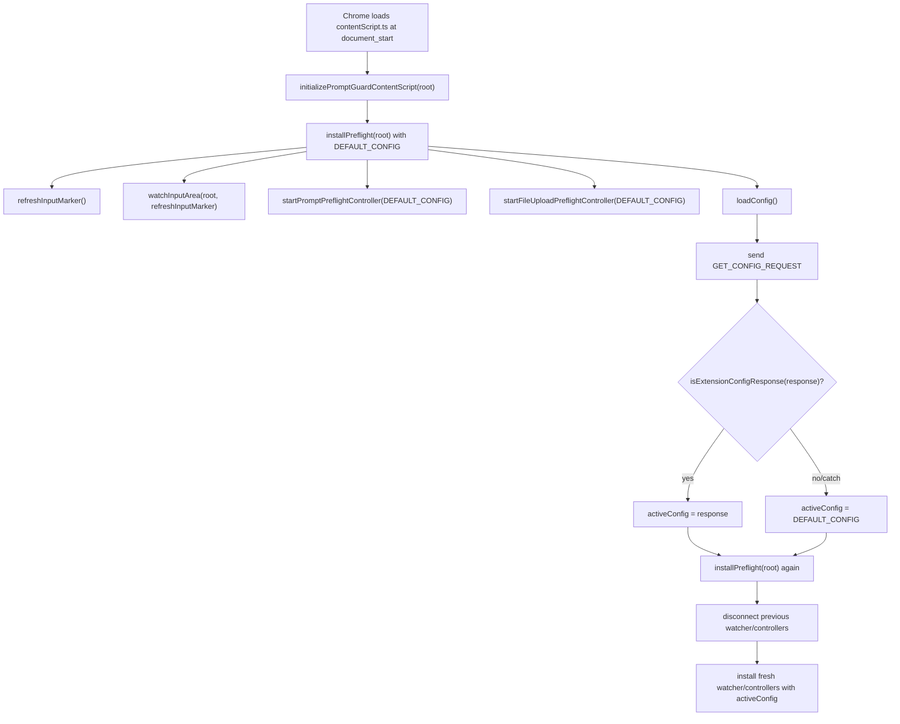
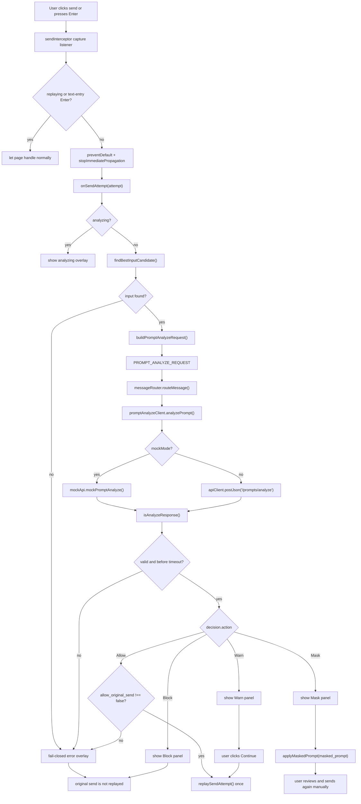
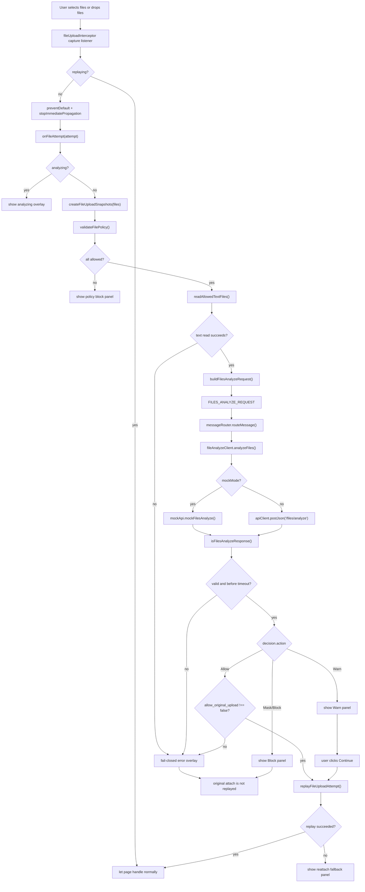
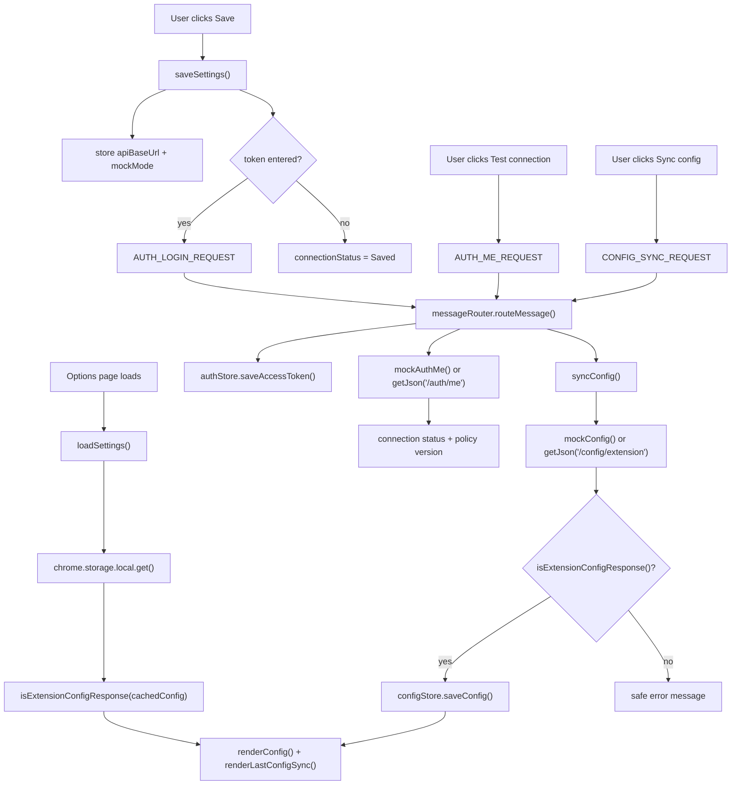

# PromptGuard Chrome Extension & Analyze Integration 개발 레퍼런스 문서 v0.4

작성일: 2026-05-22  
대상 독자: 코딩 AI, 개발자, 프로젝트 진행자  
문서 성격: 구현 코드가 아니라 **구현 기준·계약·상태머신·검증 기준을 정리한 레퍼런스 개발문서**

---

## 0. 문서 상태 요약

이 문서는 PromptGuard 프로젝트 중 **Chrome Extension + Analyze API 연동 + 파일 업로드 검사 실험 기능**을 구현하기 위한 기준 문서다. 코딩 AI가 임의로 구조를 만들지 않도록, 다음을 미리 고정한다.

- MVP 주 통제 방식은 **DOM preflight hook**이다.
- `webRequest`/`declarativeNetRequest` 기반 네트워크 감시는 MVP에서 제외한다.
- Extension은 **Manifest V3 + TypeScript** 기준이다.
- 텍스트 prompt 검사는 `/prompts/analyze`로 수행한다.
- 텍스트 기반 파일 업로드 검사는 `/files/analyze`로 수행한다.
- Mask 응답은 자동 전송하지 않고, 입력창을 치환한 뒤 사용자가 다시 전송하게 한다.
- API timeout 기본 동작은 fail-closed다.
- `raw_prompt`, `file_content`, `extracted_text`, `detected raw value`, 파일명 원문은 저장하지 않는다.
- 탐지 엔진은 “AI 의미 이해”가 아니라 **rule-based risk evidence scoring**으로 표현한다.
- 자동개선은 제외하고, 관리자 검토 기반 개선 루프만 다룬다.

---

# 1. 문서 목적

## 1.1 이 문서가 코딩 AI에게 하는 역할

이 문서는 코딩 AI가 PromptGuard Extension 구현을 시작하기 전에 참고해야 할 **기준 문서**다. 코딩 AI는 이 문서를 보고 다음을 판단해야 한다.

1. 어떤 파일 구조로 시작해야 하는가.
2. content script, service worker, options page의 책임은 무엇인가.
3. 서버와 주고받는 API request/response는 어떤 모양인가.
4. 텍스트 prompt 전송을 어떤 상태머신으로 보류·재개·차단해야 하는가.
5. 파일 업로드 검사는 어떤 파일만 대상으로 하고, 어떤 파일은 제외해야 하는가.
6. 어떤 데이터를 절대 저장하면 안 되는가.
7. 어떤 테스트를 통과해야 완료로 볼 수 있는가.

## 1.2 구현 지시서와의 차이

이 문서는 “코드를 작성하라”는 지시서가 아니다. 구현을 시작하기 전 **공통 기준을 고정**하는 문서다. 실제 구현 요청은 이 문서의 “개발 순서”와 “첫 구현 요청으로 적절한 작업 5개”를 기준으로 별도 지시한다.

## 1.3 이 문서를 보고 시작할 수 있는 작업

이 문서만 보고 바로 시작 가능한 작업은 다음이다.

- `apps/extension` Manifest V3 scaffold 작성
- shared types 초안 작성
- mock API 기반 Extension options page 구현
- ChatGPT-like fixture page 작성
- prompt 전송 preflight 상태머신 설계
- file input/drag-drop fixture 작성
- privacy regression checklist 작성

---

# 2. 현재 확정사항 / 합리적 가정 / 추후 결정사항

## 2.1 확정사항

| 항목 | 상태 | 결정 | 이유 |
|---|---|---|---|
| 주 통제 방식 | 확정 | DOM preflight hook | Warn/Mask/Block UX는 전송 전 DOM 단계가 가장 직접적이다. |
| 네트워크 감시 | 확정 | MVP 제외 | DNR은 요청 내용을 직접 읽는 구조가 아니며, MVP 복잡도를 키운다. |
| Extension 플랫폼 | 확정 | Chrome Manifest V3 + TypeScript | 현재 Chrome Extension 개발 기준과 타입 안정성 확보. |
| 구조 분리 | 확정 | content script / service worker / options page 분리 | DOM 접근, API 요청, 설정 UI 책임을 분리한다. |
| Prompt 분석 API | 확정 | `/prompts/analyze` | 전송 직전 prompt 분석용. |
| Config API | 확정 | `/config/extension` | selector, policy version, timeout, file policy 동기화. |
| 파일 분석 API | 확정 | `/files/analyze` | 텍스트 기반 파일 첨부 전 검사. |
| action enum | 확정 | `Allow`, `Warn`, `Mask`, `Block` | MVP UX와 테스트 기준을 단순화한다. |
| Mask 동작 | 확정 | 자동 전송 금지, 입력창 치환 후 사용자 재전송 | replay 오류와 사용자 의도 문제를 줄인다. |
| Timeout 기본 정책 | 확정 | fail-closed | 검사를 못 했는데 전송하면 제품 목적이 약해진다. |
| 파일 업로드 검사 | 확정 | MVP에 실험 기능으로 포함 | 사용자가 같이 구현해보기로 결정. |
| 파일 대상 | 확정 | 텍스트 기반 파일만 | PDF/Office/OCR은 범위가 크다. |
| drag/drop | 확정 | 검사 대상 포함 | 실제 ChatGPT류 UI에서 파일 드롭 업로드 가능성이 있다. |
| 탐지 엔진 표현 | 확정 | rule-based risk evidence scoring | “AI가 문맥을 이해한다”는 과장 표현을 피한다. |
| 자동개선 | 확정 | MVP 제외 | 보안 정책 자동 변경은 위험하다. |
| 저장 금지 | 확정 | raw_prompt, file_content, extracted_text, detected raw value, 파일명 원문 | privacy-by-design 핵심 원칙. |

## 2.2 임시 가정

| 항목 | 상태 | 임시 결정 | 이유 | 나중에 바꿀 수 있는가 |
|---|---|---|---|---|
| 파일 크기 제한 | 임시 가정 | 파일당 1MB, 총 3MB, 최대 5개 | MVP 성능·UX 안정성 우선 | 가능. `/config/extension`으로 조정 |
| API timeout | 임시 가정 | 3초 | 전송 UX 지연 제한 | 가능. 서버 config로 조정 |
| Extension storage | 임시 가정 | `chrome.storage.local` | service worker/options/content script 공통 접근 가능 | 가능하나 raw 저장 금지는 유지 |
| Mock API | 임시 가정 | Extension 개발 초기에 사용 | 서버 완성 전 병렬 개발 가능 | 가능 |
| Fixture 기준 | 임시 가정 | MVP는 fixture page E2E 통과를 1차 기준 | 실제 ChatGPT DOM 변동성 완화 | 실제 사이트 smoke test 추가 가능 |
| 파일 자동 재첨부 | 임시 가정 | 시도하되 실패 시 재첨부 안내 | 웹앱 내부 uploader state를 확실히 제어하기 어렵다 | adapter 안정화 후 개선 가능 |

## 2.3 추후 결정사항

| 항목 | 선택지 | 권장안 | 이유 | 리스크 |
|---|---|---|---|---|
| API 서버 기술 | FastAPI / NestJS / Go | 팀 스택에 맞춤. Extension 타입 공유를 중시하면 NestJS/TS 유리 | shared type 관리 편의 | 이미 서버 담당자가 결정했을 수 있음 |
| policy update UI | MVP 포함 / P1 | P1 | 기본 policy로 먼저 검증 | 정책 변경이 늦어질 수 있음 |
| custom filter | MVP 필수 / P1 | P1 또는 P0 후반 | 기본 detector/scoring 이후 붙이는 것이 안정적 | 조직별 차별점이 늦게 보임 |
| 실제 ChatGPT E2E | MVP 필수 / smoke only | fixture E2E + 실제 사이트 smoke | 실제 사이트 자동화는 불안정할 수 있음 | 실제 DOM 문제를 늦게 발견 가능 |
| 파일 자동 재첨부 방식 | synthetic replay / adapter / fallback | adapter + fallback | synthetic event는 실패 가능 | 사용자 UX가 한 번 더 필요할 수 있음 |
| client-side hashing | SHA-256 / 서버 HMAC / 둘 다 | 파일명 원문은 보내지 않고 client_file_id + extension 중심 | 파일명 hash도 민감할 수 있음 | 중복 식별 능력 약화 |

---

# 3. 전체 시스템 개요

## 3.1 시스템 구성

PromptGuard는 다음 컴포넌트로 구성된다.

| 컴포넌트 | 역할 |
|---|---|
| Chrome Extension | ChatGPT 화면에서 전송 전 텍스트와 파일 첨부를 감지하고 보류한다. |
| Content Script | DOM 탐지, 이벤트 capture, overlay 표시, 입력창 치환 담당. |
| Service Worker | API URL, token, config cache, API client, mock API 처리 담당. |
| Options Page | self-host API URL 입력, 로그인, 연결 상태 표시, 저장/미저장 고지. |
| Self-hosted API | prompt/file 분석, detector pipeline, scoring, masking, event logging. |
| Detector Pipeline | PII/secret/DB URL/file context/custom filter/rule evidence 생성. |
| Event Logging | 원문 없이 metadata만 저장한다. |
| Dashboard | 관리자에게 위험 통계와 event metadata를 보여준다. |

## 3.2 데이터 흐름 텍스트 다이어그램

```text
[User on ChatGPT]
   │
   │ typing / paste / click send / press Enter / attach file / drop file
   ▼
[Content Script]
   ├─ input detector
   ├─ send interceptor
   ├─ file input/drop interceptor
   ├─ overlay UI
   └─ masked text injector
   │
   │ chrome.runtime.sendMessage
   ▼
[Extension Service Worker]
   ├─ authStore: token, auth state
   ├─ configStore: selectors, timeout, file policy
   ├─ promptAnalyzeClient
   ├─ fileAnalyzeClient
   └─ mock API mode
   │
   │ HTTPS JSON
   ▼
[Self-hosted API]
   ├─ /auth/me
   ├─ /config/extension
   ├─ /prompts/analyze
   └─ /files/analyze
   │
   ▼
[Detector Pipeline]
   ├─ request validation
   ├─ normalization
   ├─ PII detector
   ├─ secret detector
   ├─ DB connection string detector
   ├─ file context detector
   ├─ rule-based risk evidence scoring
   ├─ custom filter
   ├─ overlap merge
   ├─ risk scoring
   ├─ masking
   └─ metadata-only event logging
   │
   ▼
[Response]
   └─ Allow / Warn / Mask / Block
```

---

# 4. 내 담당 범위와 전체 WBS 의존관계

## 4.1 내 담당 작업

| 영역 | 내 담당 범위 |
|---|---|
| Extension scaffold | Manifest V3 구조, TypeScript build, content/service/options 구조 |
| 서버 연결 | self-host API URL 입력, `/auth/me`, token 저장, 연결 상태 표시 |
| Config sync | `/config/extension` 호출, selector/policy/file policy cache |
| DOM preflight | 입력창 탐지, send button/Enter 보류, replay 제어 |
| UX | Allow/Warn/Mask/Block overlay, timeout/error panel |
| Masking 적용 | 서버 `masked_prompt`를 입력창에 치환 |
| API 연동 | `/prompts/analyze`, `/files/analyze` client와 mock client |
| 파일 업로드 | input file change, drag/drop, FileList snapshot, policy 검사, fallback UX |
| 검증 | fixture E2E, privacy regression, 성능 기준 |

## 4.2 다른 담당자 작업에 의존하는 부분

| 의존 대상 | 필요한 이유 | Mock으로 대체 가능 여부 |
|---|---|---|
| Auth API | 로그인/token 확인 | 가능. mock token 사용 |
| `/config/extension` | selector, timeout, file policy | 가능. fixture config 사용 |
| `/prompts/analyze` | 실제 분석 결과 | 가능. action별 mock response |
| `/files/analyze` | 파일 분석 결과 | 가능. 파일명/확장자 기반 mock |
| Detector pipeline | 실제 risk score/action | 가능. mock action 사용 |
| Event logging | 원문 미저장 확인 | 일부 가능. storage/log snapshot 검증 |
| Dashboard | Extension 구현에는 직접 의존하지 않음 | 불필요 |

## 4.3 mock으로 먼저 진행 가능한 부분

- Extension scaffold
- options page
- config sync UI
- content script injection
- input detector
- send interceptor
- overlay UX
- masked_prompt 치환
- file input/drop hook
- fixture page E2E

## 4.4 병렬 개발 가능한 부분

- 서버 담당자는 `/prompts/analyze`, `/files/analyze` schema와 detector를 구현한다.
- Extension 담당자는 mock response 기준으로 UI와 hook을 구현한다.
- QA 담당자는 fixture page와 E2E 시나리오를 작성한다.
- 문서 담당자는 API 계약과 privacy checklist를 유지한다.

## 4.5 병렬 개발하면 위험한 부분

- API schema 확정 없이 서버와 Extension을 동시에 구현하면 request/response mismatch가 발생한다.
- action enum이 변하면 Extension UX와 서버 scoring이 동시에 흔들린다.
- `Mask` 동작 방식이 바뀌면 send replay 상태머신이 바뀐다.
- 파일 자동 재첨부 정책이 바뀌면 hook 구조가 바뀐다.

---

# 5. Chrome Extension 아키텍처

## 5.1 Manifest V3 구조

Manifest V3 Extension은 background page 대신 service worker 중심으로 동작한다. Service worker는 필요할 때 로드되고 유휴 상태가 되면 종료될 수 있으므로, 장기 상태를 전역 변수에 의존하면 안 된다.

## 5.2 content script 책임

content script는 ChatGPT 페이지 DOM에 주입되어 다음을 담당한다.

- 대상 페이지에서 입력창 후보 탐지
- send button click capture
- Enter/단축키 capture
- Shift+Enter 줄바꿈 허용
- 파일 input change capture
- drag/drop capture
- overlay root mount/unmount
- `masked_prompt` 입력창 치환
- service worker와 메시지 송수신

content script는 DOM에 접근할 수 있지만 page script와 isolated world로 분리되어 있으므로, ChatGPT 내부 React state를 안정적으로 직접 수정한다고 가정하면 안 된다.

## 5.3 service worker 책임

service worker는 다음을 담당한다.

- self-host API base URL 저장/조회
- access/refresh token 저장/조회
- `/auth/me` 호출
- `/config/extension` 호출과 cache
- `/prompts/analyze` 호출
- `/files/analyze` 호출
- mock API mode
- timeout/error normalization
- content script와 options page message broker

## 5.4 options page 책임

options page는 사용자 설정 화면이다.

- API URL 입력
- 로그인/로그아웃
- 연결 상태 확인
- 현재 policy version 표시
- 마지막 config sync 시각 표시
- 저장/미저장 고지
- 파일 업로드 검사 활성화 여부 표시

## 5.5 shared types 책임

`shared/types.ts` 또는 별도 package는 다음 타입을 가진다.

- `AnalyzeRequest`
- `AnalyzeResponse`
- `FilesAnalyzeRequest`
- `FilesAnalyzeResponse`
- `ExtensionConfigResponse`
- `ExtensionMessage`
- `PromptInspectionState`
- `FileInspectionState`
- `DecisionAction`
- `DetectionSummary`

## 5.6 overlay UI 책임

overlay UI는 사용자의 현재 작업 흐름을 끊지 않으면서 분석 상태와 조치를 보여준다.

- 분석 중 spinner
- Warn panel
- Mask panel
- Block panel
- timeout panel
- file warning/block panel
- reattach fallback 안내

## 5.7 추천 파일 트리

```text
apps/extension/
  manifest.json
  package.json
  tsconfig.json
  vite.config.ts
  src/
    content/
      contentScript.ts
      domDetector.ts
      promptExtractor.ts
      sendInterceptor.ts
      keyboardInterceptor.ts
      overlay.ts
      maskedTextInjector.ts
      mutationWatcher.ts
      fileAttachmentDetector.ts
      fileDropInterceptor.ts
      fileTextExtractor.ts
      fileUploadInterceptor.ts
    background/
      serviceWorker.ts
      apiClient.ts
      promptAnalyzeClient.ts
      fileAnalyzeClient.ts
      authStore.ts
      configStore.ts
      decisionCache.ts
      mockApi.ts
      messageRouter.ts
    options/
      options.html
      options.ts
      options.css
    shared/
      types.ts
      constants.ts
      errors.ts
      sanitize.ts
      hashing.ts
      filePolicy.ts
      fileTypes.ts
      messageTypes.ts
  tests/
    unit/
    e2e/
      fixtures/
        chatgpt-like-page.html
        upload-fixture-files/
      extension.spec.ts
  README.md
```

---

# 6. DOM preflight hook 설계

## 6.1 왜 webRequest/DNR이 아니라 DOM preflight인가

MVP의 핵심은 전송 전 사용자에게 Warn/Mask/Block UX를 제공하는 것이다. 네트워크 요청 계층에서 본문을 안정적으로 분석하고 다시 UI에 반영하는 방식은 Chrome Extension MVP 범위에 맞지 않는다. 특히 DNR은 규칙 기반 요청 차단/수정 API이며 요청 내용을 직접 읽고 분석하는 용도와 다르다.

따라서 MVP는 DOM 단계에서 사용자의 전송 시도를 먼저 잡고, 서버 분석 후 원래 전송을 재개하거나 차단한다.

## 6.2 click 전송 후킹

- capture phase에서 send button click을 감지한다.
- prompt text를 추출한다.
- 원래 전송을 보류한다.
- service worker에 `PROMPT_ANALYZE_REQUEST` 메시지를 보낸다.
- 응답에 따라 Allow/Warn/Mask/Block을 처리한다.

## 6.3 Enter 전송 후킹

- 입력창 focus 상태에서 keydown을 감지한다.
- Enter가 전송인지 줄바꿈인지 구분한다.
- Shift+Enter는 줄바꿈으로 허용한다.
- IME composition 중에는 전송으로 오인하지 않는다.

## 6.4 composition 입력 상태 고려

한국어 입력 중 Enter가 조합 확정으로 쓰일 수 있다. 따라서 `compositionstart`, `compositionend`, `isComposing` 상태를 고려해, 조합 중 Enter를 전송으로 처리하지 않는다.

## 6.5 전송 보류 방식

- `preventDefault`와 `stopImmediatePropagation`은 필요한 경우에만 사용한다.
- 분석 중에는 `isAnalyzing=true`로 둔다.
- 같은 이벤트가 중복 실행되지 않도록 `client_request_id`를 생성한다.

## 6.6 전송 재개 방식

- Allow 또는 Warn 확인 후에만 재개한다.
- Mask는 자동 재개하지 않는다.
- `isReplaying=true` 상태에서 원래 전송 동작을 1회 재실행한다.
- replay 후 `isReplaying=false`로 복구한다.

## 6.7 replay 실패 가능성

ChatGPT 내부 UI가 React 상태와 연결되어 있으면 synthetic click/keydown 재현이 실패할 수 있다. 이 경우 사용자에게 “검사 완료, 다시 전송해 주세요” fallback을 제공한다.

## 6.8 DOM 변경 대응

- `/config/extension`의 selector를 우선 사용한다.
- fallback selector: `textarea`, `[contenteditable='true']`, visible send button 후보.
- MutationObserver는 입력 영역 주변 root에만 붙인다.
- DOM 전체 polling은 금지한다.

## 6.9 성능 제한

- 타이핑 중 서버 분석 금지.
- 붙여넣기 즉시 분석 금지.
- 전송 직전 분석 원칙.
- MutationObserver callback debounce/throttle.
- 긴 대화 DOM 전체 scan 금지.

---

# 7. 텍스트 prompt 검사 상태머신

## 7.1 상태 정의

| 상태 | 진입 조건 | 종료 조건 | UI | 저장 금지 데이터 |
|---|---|---|---|---|
| IDLE | 기본 상태 | 전송 시도 | 없음 | 없음 |
| USER_ATTEMPT_SEND | click/Enter 감지 | native send 보류 성공 | 없음 또는 미세 spinner | raw_prompt 저장 금지 |
| BLOCK_NATIVE_SEND | 기본 전송 차단 | 분석 요청 시작 | spinner | raw_prompt 저장 금지 |
| ANALYZING | `/prompts/analyze` 요청 중 | response/error/timeout | spinner | raw_prompt 저장 금지 |
| DECISION_ALLOW | action Allow | replay 시작 | 없음 | raw_prompt 저장 금지 |
| DECISION_WARN | action Warn | 사용자 확인/취소 | warning panel | 원문 표시 최소화 |
| DECISION_MASK | action Mask | 치환/취소 | mask panel | masked_prompt 저장 금지 |
| DECISION_BLOCK | action Block | 사용자 확인 후 닫기 | block panel | 원문 표시 금지 |
| REPLAYING | 허용된 전송 재실행 | 전송 1회 후 IDLE | 없음 | 없음 |
| ERROR | timeout/network/API error | 재시도/취소 | error panel | 원문 표시 금지 |

## 7.2 double-submit 방지 상태값

| 상태값 | 목적 |
|---|---|
| `isAnalyzing` | 분석 중 중복 요청 방지 |
| `isReplaying` | replay 이벤트가 다시 interceptor에 걸려 무한 루프 되는 것 방지 |
| `lastApprovedPromptHash` | 방금 승인된 prompt 재분석 방지 |
| `lastBlockedPromptHash` | 동일 위험 prompt 반복 전송 방지 UX에 활용 |
| `activeClientRequestId` | 중복 응답/오래된 응답 처리 방지 |
| `lastInputSnapshot` | 분석 시작 시점 입력값과 현재 입력값 비교 |

## 7.3 Mask 동작

Mask 응답은 자동 전송하지 않는다.

```text
Mask response
  → panel 표시
  → 사용자가 “마스킹 적용” 클릭
  → 입력창을 masked_prompt로 치환
  → panel 닫기
  → 사용자가 직접 다시 전송
```

이 방식은 사용자가 치환 결과를 확인할 수 있고, 자동 replay 실패 가능성을 줄인다.

---

# 8. 파일 업로드 검사 설계

## 8.1 MVP 지원 파일 형식

| 범주 | 확장자 |
|---|---|
| 일반 텍스트 | `.txt`, `.md`, `.log` |
| 데이터 텍스트 | `.csv`, `.json`, `.yaml`, `.yml`, `.xml` |
| 설정/비밀 후보 | `.env`, `.ini`, `.conf` |
| DB/쿼리 | `.sql` |
| 소스코드 | `.py`, `.js`, `.ts`, `.java`, `.go`, `.rs` |

## 8.2 제외 파일 형식

| 제외 대상 | 이유 |
|---|---|
| PDF | parser, layout, embedded object 처리 필요 |
| DOCX/XLSX/PPTX | 압축 구조와 파서 필요 |
| 이미지 OCR | OCR 정확도·성능·프라이버시 이슈 |
| 압축파일 | zip bomb, recursive scan 위험 |
| 바이너리 | 텍스트 추출 불가 |
| malware scan | 제품 범위를 보안 스캐너로 확장시킴 |

## 8.3 input[type=file] change capture

- `change` 이벤트 capture phase에서 감지한다.
- `FileList` snapshot을 만든다.
- 파일 정책을 확인한다.
- 지원되는 파일만 메모리에서 읽는다.
- `/files/analyze`로 보낸다.
- Allow/Warn/Block 결과에 따라 첨부 재개 또는 차단한다.

## 8.4 dragover/drop capture

- `dragover`는 사용자에게 drop 가능 상태 표시용으로 가볍게 처리한다.
- `drop`에서 `DataTransfer.files`를 확인한다.
- 파일이 있으면 기본 업로드 흐름을 보류한다.
- 이후 flow는 file input과 동일하다.

## 8.5 FileList snapshot

FileList는 live object처럼 다뤄질 수 있으므로, 이벤트 시점에 필요한 metadata와 File reference를 snapshot으로 분리한다.

저장 금지:
- 파일명 원문 persistent 저장
- 파일 내용 persistent 저장
- 추출 텍스트 persistent 저장

## 8.6 확장자/MIME/크기 검사

기본 임시값:

| 정책 | 기본값 |
|---|---:|
| 파일당 최대 크기 | 1MB |
| batch 총 크기 | 3MB |
| 한 번에 최대 파일 수 | 5개 |
| timeout | 3초 |

이 값은 코드에 고정하지 않고 `/config/extension`의 `file_upload` 정책으로 받는다.

## 8.7 텍스트 파일 메모리 읽기

- FileReader 또는 Blob text 기반으로 읽는다.
- 읽은 내용은 `/files/analyze` 요청 payload 구성에만 사용한다.
- 읽은 내용은 storage/log/test snapshot에 남기지 않는다.

## 8.8 파일 Mask 제외 이유

파일 내용 자동 수정 후 재첨부는 다음 문제가 있다.

- 원본 파일과 수정 파일의 사용자 의도 차이
- 파일명/확장자/인코딩 문제
- source code나 JSON 파일 구조 손상 가능성
- 첨부 replay 복잡도 증가

따라서 MVP 파일 검사는 Allow/Warn/Block 중심으로 한다.

## 8.9 자동 재첨부 fallback UX

자동 재첨부가 실패하면 다음 메시지를 보여준다.

```text
파일 검사는 완료되었지만, 현재 페이지 구조상 자동 첨부를 재개하지 못했습니다.
검사 결과 허용 가능한 파일입니다. 다시 첨부해 주세요.
```

Block이면 재첨부 안내를 하지 않는다.

---

# 9. 파일 업로드 상태머신

| 상태 | 진입 조건 | 종료 조건 | 사용자 메시지 | 완료조건 |
|---|---|---|---|---|
| IDLE | 기본 상태 | 파일 첨부 시도 | 없음 | 없음 |
| USER_ATTEMPT_ATTACH | file input/drop 감지 | event capture | 없음 | FileList 존재 |
| CAPTURE_FILE_EVENT | 첨부 흐름 보류 | 정책 검사 시작 | “파일 검사 중” | 기본 업로드 보류 |
| VALIDATE_FILE_POLICY | 확장자/MIME/크기 검사 | 통과/거절 | 제한 초과 안내 가능 | 지원 파일만 다음 단계 |
| READ_TEXT_IN_MEMORY | 텍스트 읽기 | 읽기 완료/실패 | “파일 내용을 검사 중” | storage 저장 없음 |
| ANALYZING_FILES | `/files/analyze` 요청 | response/error | spinner | timeout 처리 |
| FILE_ALLOW | action Allow | 첨부 재개 | 없음 또는 허용 안내 | attach replay 시도 |
| FILE_WARN | action Warn | 사용자 확인/취소 | warning panel | 확인 시 attach replay |
| FILE_BLOCK | action Block | 사용자 확인 | block panel | 원본 첨부 금지 |
| REPLAY_ATTACH | 허용된 첨부 재개 | 성공/실패 | 없음 | 1회 재개 |
| REATTACH_FALLBACK | 자동 재개 실패 | 사용자 재첨부 | 재첨부 안내 | UX 표시 |
| ERROR | 읽기/API 오류 | 재시도/취소 | 오류 발생 위치 표시 | 첨부 보류 |

---

# 10. API 계약 초안

## 10.1 공통 header

```http
Authorization: Bearer <access_token>
X-PromptGuard-Client: chrome-extension
X-PromptGuard-Extension-Version: 0.4.0
Content-Type: application/json
```

## 10.2 GET /auth/me

목적: 저장된 token이 유효한지 확인한다.

Response 예시:

```json
{
  "id": "user_123",
  "workspace_id": "wks_001",
  "email": "member@example.com",
  "role": "USER",
  "status": "ACTIVE",
  "policy_version": "v0.4.0-default"
}
```

## 10.3 GET /config/extension

목적: Extension이 도메인, selector, timeout, 파일 정책을 가져온다.

```json
{
  "api_base_url": "https://promptguard.example.com/api/v1",
  "policy_version": "v0.4.0-default",
  "timeout_ms": 3000,
  "ai_service_configs": [
    {
      "service": "CHATGPT",
      "domains": ["chatgpt.com", "chat.openai.com"],
      "selectors": {
        "input": ["textarea", "[contenteditable='true']"],
        "send_button": ["button[data-testid='send-button']"],
        "file_input": ["input[type='file']"],
        "drop_zone": ["body"]
      }
    }
  ],
  "file_upload": {
    "enabled": true,
    "max_file_size_bytes": 1048576,
    "max_total_size_bytes": 3145728,
    "max_file_count": 5,
    "allowed_extensions": [".txt", ".md", ".csv", ".json", ".yaml", ".yml", ".xml", ".log", ".env", ".sql", ".py", ".js", ".ts", ".java", ".go", ".rs"],
    "excluded_extensions": [".pdf", ".docx", ".xlsx", ".pptx", ".zip", ".png", ".jpg", ".jpeg"]
  }
}
```

## 10.4 POST /prompts/analyze

Request:

```json
{
  "prompt": {
    "text": "사용자가 전송하려는 텍스트",
    "input_method": "ENTER",
    "content_length": 123
  },
  "context": {
    "ai_service": "CHATGPT",
    "ai_service_domain": "chatgpt.com",
    "page_url_origin": "https://chatgpt.com",
    "extension_version": "0.4.0",
    "browser": "Chrome",
    "locale": "ko-KR"
  },
  "policy": {
    "version": "v0.4.0-default"
  },
  "client_request_id": "crq_random_without_raw_text"
}
```

Response:

```json
{
  "event_id": "evt_20260522_000001",
  "request_id": "req_abc123",
  "decision": {
    "risk_score": 72,
    "risk_level": "HIGH",
    "action": "Mask",
    "user_message": "개인정보로 보이는 항목이 포함되어 있습니다. 마스킹 후 다시 전송해 주세요.",
    "allow_original_send": false
  },
  "detections": [
    {
      "type": "EMAIL",
      "label": "이메일",
      "count": 1,
      "severity": "low",
      "confidence": 0.99,
      "source": "regex"
    }
  ],
  "masked_prompt": "[이메일] 문의 요약해줘",
  "policy": {
    "version": "v0.4.0-default",
    "latest_version": "v0.4.0-default"
  },
  "partial_result": false
}
```

금지:

- request body에 `user_id`, `workspace_id` 포함 금지
- response에 raw prompt echo 금지
- detected raw value 반환 금지

## 10.5 POST /files/analyze

Request:

```json
{
  "files": [
    {
      "client_file_id": "file_req_random",
      "name_hash": "client_side_hash_optional",
      "extension": ".env",
      "mime_type": "text/plain",
      "size_bytes": 850,
      "content_text": "파일에서 읽은 텍스트. 저장 금지."
    }
  ],
  "context": {
    "ai_service": "CHATGPT",
    "ai_service_domain": "chatgpt.com",
    "page_url_origin": "https://chatgpt.com",
    "extension_version": "0.4.0",
    "browser": "Chrome",
    "locale": "ko-KR"
  },
  "policy": {
    "version": "v0.4.0-default"
  },
  "client_request_id": "frq_random_without_file_content"
}
```

Response:

```json
{
  "event_id": "evt_20260522_000002",
  "request_id": "req_file_abc123",
  "decision": {
    "risk_score": 92,
    "risk_level": "CRITICAL",
    "action": "Block",
    "user_message": "첨부 파일에서 DB 접속 문자열 또는 API key 후보가 탐지되어 첨부가 차단되었습니다.",
    "allow_original_upload": false
  },
  "file_results": [
    {
      "client_file_id": "file_req_random",
      "extension": ".env",
      "mime_type": "text/plain",
      "size_bytes": 850,
      "detections": [
        {
          "type": "DB_CONNECTION_STRING",
          "label": "DB 접속 문자열",
          "count": 1,
          "severity": "critical",
          "confidence": 0.99,
          "source": "secret"
        }
      ]
    }
  ],
  "policy": {
    "version": "v0.4.0-default",
    "latest_version": "v0.4.0-default"
  },
  "partial_result": false
}
```

## 10.6 Error response

```json
{
  "error": {
    "code": "VALIDATION_ERROR",
    "message": "Request body is invalid.",
    "details": [
      { "field": "prompt.text", "reason": "required" }
    ],
    "request_id": "req_abc123"
  }
}
```

## 10.7 Error UX 기준

| 상황 | code | UX |
|---|---|---|
| 인증 만료 | 401 | “로그인이 만료되었습니다. 다시 로그인해 주세요.” |
| 파일/프롬프트 과대 | 413 | “크기가 너무 커서 검사할 수 없습니다.” |
| 요청 과다 | 429 | “요청이 많습니다. 잠시 후 다시 시도해 주세요.” |
| 서버 오류 | 500 | “서버 오류로 검사를 완료하지 못했습니다.” |
| 네트워크 오류 | NETWORK_ERROR | “서버에 연결할 수 없습니다.” |
| timeout | TIMEOUT | “검사 시간이 초과되어 전송이 보류되었습니다.” |

---

# 11. Extension 내부 message protocol

## 11.1 message type 목록

| 방향 | type | 목적 | 원문 포함 여부 |
|---|---|---|---|
| content → worker | `PROMPT_ANALYZE_REQUEST` | prompt 분석 요청 | 일시 포함 |
| worker → content | `PROMPT_ANALYZE_RESULT` | 분석 결과 반환 | raw 없음 |
| content → worker | `FILES_ANALYZE_REQUEST` | 파일 분석 요청 | file content 일시 포함 |
| worker → content | `FILES_ANALYZE_RESULT` | 파일 분석 결과 반환 | raw 없음 |
| options → worker | `AUTH_LOGIN_REQUEST` | 로그인 | password 일시 포함 |
| options → worker | `AUTH_ME_REQUEST` | 연결 확인 | raw 없음 |
| options → worker | `CONFIG_SYNC_REQUEST` | config sync | raw 없음 |
| worker → options | `CONFIG_SYNC_RESULT` | config 결과 | raw 없음 |
| content → worker | `GET_CONFIG_REQUEST` | content script config 요청 | raw 없음 |
| worker → content | `GET_CONFIG_RESULT` | config 전달 | raw 없음 |

## 11.2 원문 포함 message 주의

`PROMPT_ANALYZE_REQUEST`와 `FILES_ANALYZE_REQUEST`에는 분석을 위해 원문이 일시 포함된다. 이 message는 다음 원칙을 따른다.

- storage에 저장하지 않는다.
- console에 출력하지 않는다.
- error object에 포함하지 않는다.
- test snapshot에 저장하지 않는다.
- message handling 완료 후 참조를 해제한다.

## 11.3 client_request_id 생성 기준

- raw prompt, file content, file name을 포함하지 않는다.
- 랜덤 ID 또는 timestamp + random suffix를 사용한다.
- idempotency/debug 용도이며 원문 복원 가능성이 없어야 한다.

---

# 12. Detector pipeline 연동 관점

## 12.1 Extension의 기본 원칙

Extension은 자체 탐지를 주 판단 기준으로 삼지 않는다. 서버 decision을 신뢰한다. Extension의 역할은 다음이다.

- 사용자 입력/파일을 전송 전에 포착
- 분석 요청 전송
- 서버 decision에 따라 UX 처리
- 원문 저장 금지 보장

## 12.2 서버 detector pipeline 요약

```text
request validation
  → normalize
  → PII detector
  → Secret detector
  → DB connection string detector
  → file context detector
  → custom filter
  → rule-based risk evidence scoring
  → overlap merge
  → risk scoring
  → masking
  → event logging
  → response
```

## 12.3 Extension이 알아야 하는 response field

| field | 사용처 |
|---|---|
| `decision.action` | Allow/Warn/Mask/Block 분기 |
| `decision.user_message` | panel 표시 |
| `masked_prompt` | Mask 치환 |
| `detections[].label/count/severity` | 사용자에게 요약 표시 |
| `policy.latest_version` | config 재동기화 판단 |
| `partial_result` | 제한된 검사 결과 경고 표시 |
| `file_results` | 파일별 결과 표시 |

---

# 13. rule-based risk evidence scoring 설명

## 13.1 AI 문맥 이해가 아니다

이 프로젝트의 문맥 처리는 LLM 의미 이해가 아니다. MVP는 rule 기반 증거 조합이다.

```text
문장/문단 window 분리
  → PII/secret/금액/키워드 탐지
  → 같은 window 안의 조합 확인
  → reason_code와 confidence 계산
  → risk_score에 반영
```

## 13.2 CUSTOMER_INFO 예시

조건 예시:

- EMAIL 또는 PHONE 존재
- 같은 window 안에 “고객사”, “담당자”, “문의”, “장애”, “티켓”, “CS” 중 하나 이상 존재
- “님”, “매니저”, “담당자” 같은 표현 존재

결과 예시:

```json
{
  "type": "CUSTOMER_INFO",
  "confidence": 0.78,
  "source": "rule_context",
  "reason_code": "PII_WITH_CUSTOMER_SUPPORT_KEYWORDS",
  "evidence_counts": {
    "pii": 2,
    "customer_keywords": 3
  }
}
```

## 13.3 CONTRACT_INFO 예시

조건 예시:

- 금액/할인율/기간 표현 존재
- 같은 window 안에 “계약”, “NDA”, “위약금”, “갱신”, “견적”, “제안서” 존재

결과:

```json
{
  "type": "CONTRACT_INFO",
  "confidence": 0.82,
  "source": "rule_context",
  "reason_code": "MONEY_AND_CONTRACT_KEYWORDS_IN_SAME_WINDOW",
  "evidence_counts": {
    "money_amount": 2,
    "contract_keywords": 3
  }
}
```

## 13.4 SECRET_FILE_CONTEXT 예시

조건 예시:

- 파일 확장자가 `.env`
- `DATABASE_URL`, `SECRET`, `TOKEN`, `PASSWORD` 키 존재

결과:

```json
{
  "type": "SECRET_FILE_CONTEXT",
  "confidence": 0.9,
  "source": "file_context",
  "reason_code": "ENV_FILE_WITH_SECRET_KEYS",
  "evidence_counts": {
    "secret_key_names": 3,
    "file_context": 1
  }
}
```

## 13.5 한계

- 우회 표현을 완전히 잡지 못한다.
- 새로운 업무 용어는 custom filter나 rule update가 필요하다.
- 문맥 판단이 아니라 증거 조합이므로 confidence는 보수적으로 사용해야 한다.

## 13.6 관리자 검토 기반 개선 루프

```text
오탐/미탐 발견
  → 사용자 또는 관리자 피드백
  → corpus에 positive/negative sample 추가
  → rule/custom filter/policy 수동 수정
  → test 통과
  → rule_version/policy_version 증가
  → dashboard에서 추세 확인
```

---

# 14. UX 설계

## 14.1 서버 연결 화면

표시 항목:

- API URL 입력
- 연결 테스트 버튼
- 현재 연결 상태
- 마지막 성공 시각
- 저장/미저장 고지 링크

## 14.2 로그인 화면

- email/password 또는 token 입력
- 로그인 성공 시 `/auth/me` 호출
- role/status/policy_version 표시

## 14.3 저장/미저장 고지

사용자에게 다음을 명확히 표시한다.

- 전송 직전 보안 검사를 수행한다.
- prompt 원문은 저장하지 않는다.
- 파일 내용은 저장하지 않는다.
- 탐지된 실제 값은 저장하지 않는다.
- 관리자는 원문을 볼 수 없다.
- 위험 유형, 위험도, 조치 결과 같은 metadata만 저장된다.

## 14.4 분석 중 spinner

- 전송 보류 중임을 보여준다.
- 3초 이상 지연되면 timeout UX로 전환한다.

## 14.5 Warn panel

메시지 예시:

```text
민감정보로 보이는 항목이 포함되어 있습니다.
전송 전 내용을 확인해 주세요.
[계속 전송] [취소]
```

## 14.6 Mask panel

```text
민감정보를 마스킹할 수 있습니다.
마스킹을 적용하면 입력창 내용이 치환됩니다. 치환 결과를 확인한 뒤 다시 전송해 주세요.
[마스킹 적용] [취소]
```

## 14.7 Block panel

```text
회사 정책상 원문 전송이 차단되었습니다.
탐지 유형: API key 후보, DB 접속 문자열
[확인]
```

## 14.8 Timeout panel

```text
검사를 완료하지 못해 전송이 보류되었습니다.
네트워크 또는 서버 상태를 확인한 뒤 다시 시도해 주세요.
[다시 시도] [취소]
```

## 14.9 파일 차단 panel

```text
첨부 파일에서 민감정보 후보가 탐지되어 첨부가 차단되었습니다.
파일 유형: .env
탐지 유형: DB 접속 문자열, API key 후보
[확인]
```

## 14.10 파일 재첨부 fallback panel

```text
파일 검사는 완료되었지만 현재 페이지 구조상 자동 첨부를 재개하지 못했습니다.
검사 결과 허용 가능한 파일입니다. 다시 첨부해 주세요.
```

---

# 15. 보안·프라이버시 원칙

## 15.1 저장 금지 데이터

| 데이터 | 저장 금지 이유 |
|---|---|
| raw_prompt | 사용자 업무 원문일 수 있음 |
| masked_prompt 전체 | 원문 일부가 남을 수 있음 |
| file_content | 파일 자체가 민감할 수 있음 |
| extracted_text | 파일 원문과 동일한 위험 |
| detected raw value | 이메일, token, DB URL 등 민감값 |
| 파일명 원문 | 고객명/프로젝트명이 들어갈 수 있음 |
| full page URL path/query | 문서명/조직 정보가 포함될 수 있음 |

## 15.2 저장 가능 metadata

| 데이터 | 저장 가능 조건 |
|---|---|
| event_id | 랜덤 식별자 |
| user_id | 서버 JWT 기준 |
| ai_service | CHATGPT 등 |
| origin | `https://chatgpt.com` 수준 |
| prompt_length | 길이만 저장 |
| prompt_hash | HMAC 기반, 원문 복원 불가 |
| detection_types | 유형만 저장 |
| detection count | 값 없이 count만 저장 |
| risk_score | 0~100 |
| action | Allow/Warn/Mask/Block |
| policy_version | 분석 시점 정책 |
| file extension | 원문 파일명 제외 |
| file size | bytes |
| mime_type | MIME |

## 15.3 chrome.storage 저장 가능/금지

저장 가능:

- API base URL
- access token / refresh token
- policy version
- config cache
- last sync timestamp
- UI 설정

저장 금지:

- raw_prompt
- file_content
- extracted_text
- detected raw value
- 파일명 원문
- masked_prompt 전체

## 15.4 console.log 금지

다음 객체를 그대로 log로 출력하면 안 된다.

- AnalyzeRequest
- FilesAnalyzeRequest
- File object content
- prompt text
- error context containing request body

## 15.5 test snapshot 금지

테스트 snapshot에는 원문 payload가 들어가면 안 된다. 테스트에는 dummy redacted string 또는 metadata만 사용한다.

## 15.6 raw_prompt 저장 기능이 없어도 검증이 필요한 이유

저장 기능을 만들지 않아도 다음 경로로 원문이 새어 나갈 수 있다.

- debug console
- error handler
- failed request dump
- mock API log
- test snapshot
- browser storage
- telemetry

따라서 privacy regression은 필수다.

---

# 16. 테스트 전략

## 16.1 Unit test

대상:

- selector candidate scoring
- prompt extractor
- masked text injector
- file policy validator
- file type classifier
- message payload sanitizer
- state reducer

## 16.2 Integration test

대상:

- mock API client
- `/prompts/analyze` request builder
- `/files/analyze` request builder
- error normalization
- configStore/authStore

## 16.3 Extension E2E

대상:

- fixture page에서 실제 사용자 흐름 재현
- send button click
- Enter
- Shift+Enter
- Allow/Warn/Mask/Block
- file input
- drag/drop

## 16.4 Privacy regression

검사 대상:

- chrome.storage mock
- console output mock
- error object
- test snapshot
- mock API request log

검증:

- seeded raw prompt 문자열 0건
- seeded file content 문자열 0건
- seeded token 문자열 0건
- 파일명 원문 0건

## 16.5 Performance test

시나리오:

- 빠른 타이핑 중 analyze 호출 없음
- 긴 대화 DOM에서 observer callback 과다 실행 없음
- 큰 paste 후 UI freeze 없음
- 1MB 텍스트 파일 검사 중 UI blocking 없음
- timeout 시 panel 표시

---

# 17. E2E와 fixture page 상세 설명

## 17.1 E2E란

E2E는 End-to-End Test다. 사용자가 실제로 하는 흐름을 처음부터 끝까지 검증한다.

예:

```text
사용자 입력
  → 전송 클릭
  → Extension이 전송 보류
  → mock API가 Mask 응답
  → Mask panel 표시
  → 사용자가 마스킹 적용
  → 입력창이 masked_prompt로 바뀜
```

## 17.2 fixture page란

fixture page는 실제 ChatGPT가 아니라 테스트용으로 만든 가짜 ChatGPT 화면이다. 실제 ChatGPT DOM은 계속 바뀔 수 있으므로, MVP 테스트는 fixture에서 먼저 안정화한다.

## 17.3 fixture page에 포함할 요소

- textarea 입력창
- contenteditable 입력창
- send button
- fake submit handler
- file input
- drag/drop zone
- fake upload handler
- long conversation DOM
- re-render button

## 17.4 실제 ChatGPT 테스트와의 차이

| 구분 | fixture page | 실제 ChatGPT |
|---|---|---|
| 안정성 | 높음 | 낮음 |
| 재현성 | 높음 | 낮음 |
| DOM 변경 | 통제 가능 | 외부 의존 |
| 신뢰도 | 기본 흐름 검증 | 실제 호환성 검증 |

MVP 기준은 fixture E2E 통과 + 실제 ChatGPT smoke test로 둔다.

---

# 18. 성능 요구사항

| 항목 | 기준 |
|---|---|
| 타이핑 중 서버 분석 | 금지 |
| 붙여넣기 직후 서버 분석 | 기본 금지 |
| 분석 시점 | 전송 직전 |
| MutationObserver | debounce/throttle 필수 |
| DOM polling | 금지 |
| prompt analyze timeout | 기본 3초 |
| overlay 렌더링 | API 응답 후 100ms 이내 목표 |
| 파일 크기 | config 기반 제한 |
| file read | 비동기, UI blocking 금지 |

---

# 19. 개발 순서

## 19.1 1단계: mock 기반 Extension scaffold

완료기준:

- unpacked extension 로드 가능
- content script/service worker/options page build 가능
- mock API mode 선택 가능

## 19.2 2단계: options 연결 화면

완료기준:

- API URL 저장
- mock login
- 연결 상태 표시

## 19.3 3단계: config sync

완료기준:

- `/config/extension` mock 호출
- selector, timeout, file policy cache

## 19.4 4단계: input detector

완료기준:

- textarea 탐지
- contenteditable 탐지
- visible/focus 기준 후보 선택

## 19.5 5단계: send interceptor

완료기준:

- click 보류
- Enter 보류
- Shift+Enter 허용
- composition 중 Enter 오탐 방지

## 19.6 6단계: prompt analyze mock

완료기준:

- Allow/Warn/Mask/Block mock response 분기
- timeout/error mock 가능

## 19.7 7단계: action UX

완료기준:

- Warn panel
- Mask panel
- Block panel
- timeout panel

## 19.8 8단계: masked_prompt 치환

완료기준:

- textarea 치환
- contenteditable 치환
- 치환 후 사용자 재전송 가능

## 19.9 9단계: E2E fixture

완료기준:

- fixture page에서 prompt flows 통과

## 19.10 10단계: 실제 API 연동

완료기준:

- `/auth/me`
- `/config/extension`
- `/prompts/analyze`

## 19.11 11단계: 파일 업로드 hook

완료기준:

- file input change capture
- drag/drop capture
- FileList snapshot

## 19.12 12단계: files analyze mock

완료기준:

- `/files/analyze` mock
- Allow/Warn/Block file UX
- fallback panel

## 19.13 13단계: privacy regression

완료기준:

- seeded raw prompt 0건
- seeded file content 0건
- seeded filename 0건

## 19.14 14단계: 성능 테스트

완료기준:

- 타이핑 지연 없음
- observer 과다 호출 없음
- file read UI blocking 없음

---

# 20. P0/P1/P2 범위

## 20.1 P0 필수

- Extension scaffold
- options 연결 화면
- config sync
- input detector
- send interceptor
- `/prompts/analyze` client
- Allow/Warn/Mask/Block UX
- masked_prompt 치환
- double-submit 방지
- raw_prompt 저장 금지 검증
- ChatGPT-like fixture E2E
- file input/drag-drop hook
- `/files/analyze` mock
- 파일 Allow/Warn/Block UX
- file_content 저장 금지 검증

## 20.2 P1 가능하면 구현

- 실제 `/files/analyze` 연동
- selector 변경 회귀 테스트 강화
- 오탐 피드백 UI
- decision cache
- 서버 상태 상세 표시
- file attach 자동 replay adapter 개선

## 20.3 P2 후속

- webRequest/DNR 보조 감시
- PDF/DOCX/XLSX parsing
- OCR
- 압축파일 검사
- malware scan
- Local LLM context classifier
- WASM scanner 최적화
- 다중 AI 서비스 adapter

---

# 21. 위험요소와 한계

| 위험 | 설명 | 대응 |
|---|---|---|
| ChatGPT DOM 변경 | selector가 깨질 수 있음 | remote config, fallback selector, fixture regression |
| synthetic replay 실패 | React 내부 state 때문에 재실행 실패 가능 | fallback UX |
| 파일 자동 재첨부 실패 | file input/drop 재현 어려움 | 재첨부 안내 |
| service worker lifecycle | 전역 상태 유지 보장 안 됨 | storage/config 재조회 가능 구조 |
| token 만료 | 분석 요청 실패 | 401 UX, refresh/relogin |
| 서버 timeout | 전송 UX 지연 | fail-closed + 재시도 |
| 오탐/미탐 | rule-based 한계 | corpus + 관리자 검토 개선 |
| Extension 비활성화 | 탐지 불가 | 한계 명시 |
| 파일명 민감정보 | 파일명에 고객명/프로젝트명 포함 가능 | 원문 저장 금지 |
| 대용량 파일 | UI freeze/서버 부하 | 사전 크기 제한 |

---

# 22. 코딩 AI에게 넘길 때의 구현 체크리스트

## 22.1 구현 전 확인

- action enum은 4개로 유지하는가?
- Mask는 자동 전송하지 않는가?
- timeout은 fail-closed인가?
- `/config/extension` mock이 있는가?
- fixture page가 있는가?
- raw 저장 금지 테스트가 있는가?

## 22.2 구현 중 금지사항

- raw_prompt console.log 금지
- file_content console.log 금지
- chrome.storage에 원문 저장 금지
- request body 전체 error dump 금지
- test snapshot에 원문 저장 금지
- DOM 전체 polling 금지
- 타이핑 중 서버 분석 금지
- 파일 자동 마스킹/재작성 금지

## 22.3 구현 후 검증

- unpacked extension 로드
- fixture page prompt E2E
- fixture page file E2E
- timeout UX
- 401 UX
- raw 저장 금지 scan
- 성능 smoke test

## 22.4 PR 리뷰 기준

- 책임 분리가 지켜졌는가?
- content script가 API token을 불필요하게 다루지 않는가?
- service worker가 DOM 접근을 시도하지 않는가?
- raw/file content 저장 금지 원칙이 지켜졌는가?
- 테스트가 기능과 privacy를 함께 검증하는가?

## 22.5 완료 정의

작업 완료는 단순 구현이 아니라 다음을 모두 만족해야 한다.

- 기능 동작
- E2E 또는 unit test 통과
- privacy 검증 통과
- timeout/error 처리
- 문서 업데이트
- 남은 리스크 명시

---

# 23. 용어집

| 용어 | 의미 |
|---|---|
| DOM preflight hook | 사용자가 전송하기 전 DOM 이벤트를 선점해 검사하는 방식 |
| Manifest V3 | 현재 Chrome Extension 플랫폼 구조 |
| content script | 웹페이지 DOM에서 동작하는 확장 스크립트 |
| service worker | 확장의 background event handler |
| options page | 확장 설정 화면 |
| fixture page | 테스트용 가짜 ChatGPT 페이지 |
| E2E | 사용자 흐름을 처음부터 끝까지 검증하는 테스트 |
| replay | 보류했던 전송/첨부 동작을 다시 실행하는 것 |
| double-submit | 전송이 중복으로 발생하는 문제 |
| MutationObserver | DOM 변경 감시 API |
| risk evidence | 위험 판단에 쓰는 탐지 증거 |
| rule pack | 규칙 묶음 |
| custom filter | 관리자가 설정하는 regex/keyword 필터 |
| HMAC prompt_hash | 원문 복원 없이 중복 식별하는 hash |
| metadata-only logging | 원문 없이 유형·점수·조치만 저장하는 방식 |
| privacy regression | 원문 저장 금지 회귀 테스트 |

---

# 24. 코딩 AI가 이 문서를 사용할 때 지켜야 할 10가지 원칙

1. 코딩 전에 API 계약과 상태머신을 먼저 확인한다.
2. raw_prompt와 file_content를 절대 저장하지 않는다.
3. Mask는 자동 전송하지 않는다.
4. timeout은 기본 fail-closed로 처리한다.
5. DOM 전체 polling을 만들지 않는다.
6. fixture E2E를 먼저 통과시킨다.
7. 실제 ChatGPT DOM에만 의존하지 않는다.
8. 파일 업로드는 텍스트 기반 파일만 처리한다.
9. 파일 자동 재첨부 실패를 정상 가능한 케이스로 다룬다.
10. 구현 완료 시 privacy regression 결과를 함께 보고한다.

---

# 25. 첫 구현 요청으로 가장 적절한 작업 5개

1. `apps/extension` Manifest V3 scaffold 작성
2. shared types와 mock API response 정의
3. options page의 API URL 저장·연결 상태 화면 구현
4. ChatGPT-like fixture page 작성
5. textarea/contenteditable input detector 구현

이 5개는 서버가 완성되지 않아도 진행 가능하고, 이후 모든 작업의 기반이 된다.

---

# 26. 아직 구현하지 말아야 할 작업 10개

1. webRequest/DNR 감시
2. PDF parser
3. DOCX/XLSX/PPTX parser
4. OCR
5. 압축파일 recursive scan
6. malware scan
7. Local LLM classifier
8. 파일 내용 자동 마스킹/재작성
9. 자동 정책 개선
10. 다중 AI 서비스 adapter

---

# 27. 개발 진행 중 매번 확인해야 할 질문 목록

1. 이 작업이 raw_prompt 또는 file_content를 저장하지 않는가?
2. 이 작업은 content script와 service worker 책임을 섞지 않았는가?
3. 이 작업은 timeout과 error UX를 처리하는가?
4. 이 작업은 fixture에서 재현 가능한가?
5. 이 작업은 실제 ChatGPT DOM 변경에 너무 강하게 의존하지 않는가?
6. 이 작업은 사용자의 타이핑 성능을 떨어뜨리지 않는가?
7. 이 작업은 중복 전송을 만들지 않는가?
8. 이 작업은 replay 무한 루프를 만들지 않는가?
9. 이 작업은 파일 자동 재첨부 실패를 처리하는가?
10. 이 작업은 테스트와 완료기준이 있는가?

---

# 28. 참고 기술 근거

이 문서의 Chrome Extension 및 파일 처리 설계는 다음 기술 사실을 전제로 한다.

- Chrome Extension content script는 웹페이지 DOM에 접근하지만 isolated world에서 실행된다.
- Manifest V3 확장의 background 로직은 service worker 중심이며, service worker는 필요할 때 로드되고 유휴 시 종료될 수 있다.
- Extension Storage API는 service worker와 content script 등 extension context에서 접근 가능하지만, raw prompt/file content 저장소로 쓰면 안 된다.
- DNR은 declarative rule 기반 요청 차단/수정 API이며 요청 내용을 직접 읽고 분석하는 목적과 다르다.
- FileReader/File API는 사용자가 선택하거나 drag/drop한 File 객체 내용을 비동기로 읽을 수 있지만, 사용자가 명시적으로 선택하지 않은 로컬 파일을 임의로 읽는 용도는 아니다.

---

# 29. 현재 구현 설명

이 섹션은 2026-05-22 기준 repository에 반영된 Chrome Extension MVP 구현 스냅샷이다. 위 섹션들의 기준은 구현 계약이고, 이 섹션은 실제 파일과 동작을 설명한다.

## 29.1 구현된 전체 구성

현재 구현은 `apps/extension` 아래 Manifest V3 + TypeScript + Vite 구조로 구성된다.

| 영역 | 구현 파일 | 역할 |
|---|---|---|
| Manifest | `apps/extension/manifest.json` | Chrome MV3 선언, storage permission, ChatGPT content script match, service worker 등록 |
| Content script entry | `apps/extension/src/content/contentScript.ts` | config 로드, prompt preflight controller 설치, file upload preflight controller 설치 |
| Background worker | `apps/extension/src/background/serviceWorker.ts`, `messageRouter.ts` | content/options 메시지 수신, API/mock/store 라우팅 |
| Prompt analyze | `promptPreflightController.ts`, `sendInterceptor.ts`, `promptExtractor.ts`, `maskedTextInjector.ts` | click/Enter 전송 보류, prompt 분석 요청, Allow/Warn/Mask/Block 처리 |
| File analyze | `fileUploadPreflightController.ts`, `fileUploadInterceptor.ts`, `fileUploadSnapshot.ts`, `textFileReader.ts` | file input/drop 보류, 텍스트 파일 정책 검사, 메모리 읽기, `/files/analyze` 요청 |
| API client | `apiClient.ts`, `promptAnalyzeClient.ts`, `fileAnalyzeClient.ts` | real API/mock API 분기, timeout, error normalization |
| Options page | `options.html`, `options.ts`, `options.css` | API URL, token 저장, mock mode, connection test, config sync |
| Shared contract | `shared/types.ts`, `messageTypes.ts`, `responseValidation.ts`, `configValidation.ts` | request/response/message/config 런타임 검증 |
| Privacy guard | `sanitize.ts`, `privacyRegression.test.ts` | 진단 payload에서 금지 key redaction 및 회귀 테스트 |

## 29.2 런타임 데이터 흐름

1. `contentScript.ts`가 `DEFAULT_CONFIG`로 먼저 DOM hook을 설치한다.
2. content script가 service worker에 `GET_CONFIG_REQUEST`를 보내고, 유효한 config를 받으면 controller를 재설치한다.
3. prompt 전송 시도는 `sendInterceptor.ts`에서 click 또는 Enter capture 단계로 보류된다.
4. `promptPreflightController.ts`가 현재 input에서 prompt text를 추출해 `PROMPT_ANALYZE_REQUEST` 메시지를 보낸다.
5. `messageRouter.ts`는 mock mode이면 `mockApi.ts`, real mode이면 `postJson("/prompts/analyze")`로 라우팅한다.
6. 응답은 `responseValidation.ts`로 검증한 뒤 action별 UX로 분기한다.
7. file input/drop 시도는 `fileUploadInterceptor.ts`에서 capture 단계로 보류된다.
8. `fileUploadPreflightController.ts`가 파일 정책을 먼저 검사하고, 허용된 텍스트 파일만 메모리에서 읽어 `FILES_ANALYZE_REQUEST`를 보낸다.
9. 파일 분석 응답이 Allow/Warn이면 원래 첨부를 replay 시도하고, replay가 불가능하면 재첨부 fallback panel을 표시한다.
10. Block, timeout, validation error, network error는 전송 또는 첨부를 재개하지 않는 fail-closed 경로로 처리한다.

## 29.2.1 모듈 의존 flowchart

```mermaid
graph TD
  Manifest["manifest.json"] --> ContentEntry["content/contentScript.ts"]
  Manifest --> WorkerEntry["background/serviceWorker.ts"]
  Manifest --> OptionsPage["options/options.html + options.ts"]

  ContentEntry --> PromptController["content/promptPreflightController.ts"]
  ContentEntry --> FileController["content/fileUploadPreflightController.ts"]
  ContentEntry --> Detector["content/domDetector.ts"]
  ContentEntry --> MutationWatcher["content/mutationWatcher.ts"]

  PromptController --> SendInterceptor["content/sendInterceptor.ts"]
  PromptController --> PromptExtractor["content/promptExtractor.ts"]
  PromptController --> MaskInjector["content/maskedTextInjector.ts"]
  PromptController --> Overlay["content/preflightOverlay.ts"]
  PromptController --> ResponseValidation["shared/responseValidation.ts"]
  PromptController --> RuntimeMessage["chrome.runtime.sendMessage"]

  FileController --> FileInterceptor["content/fileUploadInterceptor.ts"]
  FileController --> FileSnapshot["content/fileUploadSnapshot.ts"]
  FileController --> FilePolicy["shared/filePolicy.ts"]
  FileController --> TextReader["content/textFileReader.ts"]
  FileController --> Overlay
  FileController --> ResponseValidation
  FileController --> RuntimeMessage

  RuntimeMessage --> Router["background/messageRouter.ts"]
  WorkerEntry --> Router
  Router --> PromptClient["background/promptAnalyzeClient.ts"]
  Router --> FileClient["background/fileAnalyzeClient.ts"]
  Router --> ConfigStore["background/configStore.ts"]
  Router --> AuthStore["background/authStore.ts"]
  Router --> MockApi["background/mockApi.ts"]

  PromptClient --> ApiClient["background/apiClient.ts"]
  FileClient --> ApiClient
  PromptClient --> MockApi
  FileClient --> MockApi
  ConfigStore --> ConfigValidation["shared/configValidation.ts"]
  Router --> MessageTypes["shared/messageTypes.ts"]
  OptionsPage --> Router
```



| 박스 | 의미 | 주요 함수/진입점 |
|---|---|---|
| `manifest.json` | Chrome이 어떤 extension entry를 로드할지 선언한다. | content script match, service worker, options page |
| `contentScript.ts` | 페이지에 설치되는 최상위 entry다. prompt/file controller를 설치하고 config 재로드 후 재설치한다. | `initializePromptGuardContentScript()`, `installPreflight()`, `loadConfig()` |
| `promptPreflightController.ts` | prompt 전송 전 분석 상태머신의 중심이다. | `startPromptPreflightController()`, `handleAttempt()`, `handleDecision()`, `buildPromptAnalyzeRequest()` |
| `fileUploadPreflightController.ts` | 파일 첨부 전 분석 상태머신의 중심이다. | `startFileUploadPreflightController()`, `handleAttempt()`, `handleDecision()`, `buildFilesAnalyzeRequest()` |
| `messageRouter.ts` | content/options 메시지를 background 기능으로 라우팅한다. | `routeMessage()` |
| `apiClient.ts` | real API 호출의 공통 boundary다. | `postJson()`, `getJson()`, `apiUrl()` |
| `mockApi.ts` | 서버가 준비되지 않은 상태에서 동일한 message/API flow를 테스트하게 한다. | `mockPromptAnalyze()`, `mockFilesAnalyze()`, `mockConfig()`, `mockAuthMe()` |
| `shared/*Validation.ts` | 외부 입력과 runtime message를 사용 전에 shape guard로 검증한다. | `isExtensionMessage()`, `isAnalyzeResponse()`, `isFilesAnalyzeResponse()`, `isExtensionConfigResponse()` |

## 29.2.2 Content script startup flowchart



| 박스 | 모듈/함수 | 설명 |
|---|---|---|
| `contentScript.ts at document_start` | `manifest.json` content script | 페이지가 완전히 안정화되기 전부터 preflight hook을 준비한다. |
| `initializePromptGuardContentScript()` | `contentScript.ts` | 최초 설치와 config 로드 후 재설치를 조율한다. |
| `installPreflight()` | `contentScript.ts` | watcher, prompt controller, file controller를 한 번에 설치한다. 기존 controller가 있으면 먼저 해제한다. |
| `refreshInputMarker()` | `contentScript.ts` + `domDetector.ts` | 현재 DOM에서 입력창 후보를 찾고 `documentElement.dataset.promptguardInputDetected`를 갱신한다. |
| `watchInputArea()` | `mutationWatcher.ts` | DOM 변경 시 입력창 탐지를 다시 수행한다. |
| `GET_CONFIG_REQUEST` | `chrome.runtime.sendMessage` -> `messageRouter.ts` | background에 cached config를 요청한다. |
| `isExtensionConfigResponse()` | `configValidation.ts` | config shape가 유효할 때만 active config로 사용한다. |

## 29.2.3 Prompt preflight flowchart



| 박스 | 모듈/함수 | 설명 |
|---|---|---|
| `sendInterceptor capture listener` | `installSendInterceptor()` | send button click과 Enter keydown을 capture 단계에서 잡는다. Shift+Enter와 composition 중 Enter는 제외한다. |
| `onSendAttempt(attempt)` | `startPromptPreflightController()` 내부 | native send를 보류한 뒤 prompt 분석 flow로 넘긴다. |
| `findBestInputCandidate()` | `domDetector.ts` | config selector 기준으로 textarea/contenteditable 후보를 찾는다. |
| `buildPromptAnalyzeRequest()` | `promptPreflightController.ts` | prompt text, input method, origin-only context, policy version, client request id를 만든다. |
| `PROMPT_ANALYZE_REQUEST` | `messageTypes.ts` + `chrome.runtime.sendMessage` | content script에서 background worker로 분석 요청을 넘기는 message boundary다. |
| `analyzePrompt()` | `promptAnalyzeClient.ts` | mock API 또는 real API 호출을 선택한다. |
| `postJson('/prompts/analyze')` | `apiClient.ts` | bearer token, extension headers, timeout signal로 서버에 POST한다. |
| `isAnalyzeResponse()` | `responseValidation.ts` | 서버/mock 응답이 action 처리에 필요한 shape인지 검증한다. |
| `replaySendAttempt()` | `sendInterceptor.ts` | 허가된 Allow 또는 확인된 Warn에서만 원래 send button을 한 번 재실행한다. |
| `applyMaskedPrompt()` | `maskedTextInjector.ts` | 입력창 값을 `masked_prompt`로 치환한다. 자동 전송은 하지 않는다. |
| `fail-closed error overlay` | `preflightOverlay.ts` | timeout, validation error, input 미탐지, API 실패 시 원래 전송을 재개하지 않는다. |

## 29.2.4 File upload preflight flowchart



| 박스 | 모듈/함수 | 설명 |
|---|---|---|
| `fileUploadInterceptor capture listener` | `installFileUploadInterceptor()` | file input change와 drop event를 capture 단계에서 잡는다. |
| `createFileUploadSnapshots()` | `fileUploadSnapshot.ts` | `File` 객체와 policy 판단용 name/size/type metadata, `client_file_id`를 묶는다. |
| `validateFilePolicy()` | `filePolicy.ts` | file count, total size, single file size, extension, MIME, enabled flag를 검사한다. |
| `readAllowedTextFiles()` | `textFileReader.ts` | 허용된 파일만 메모리에서 텍스트로 읽고, binary-like content는 거부한다. |
| `buildFilesAnalyzeRequest()` | `fileUploadPreflightController.ts` | extension, MIME, size, content text, context, policy, request id를 만든다. 파일명 원문은 넣지 않는다. |
| `FILES_ANALYZE_REQUEST` | `messageTypes.ts` + `chrome.runtime.sendMessage` | content script에서 background worker로 파일 분석 요청을 넘기는 message boundary다. |
| `analyzeFiles()` | `fileAnalyzeClient.ts` | mock API 또는 real `/files/analyze` 호출을 선택한다. |
| `isFilesAnalyzeResponse()` | `responseValidation.ts` | file decision, file results, policy status shape를 검증한다. |
| `replayFileUploadAttempt()` | `fileUploadInterceptor.ts` | input change replay만 시도한다. drop replay는 fallback으로 남긴다. |
| `reattach fallback panel` | `fileUploadPreflightController.ts` + `preflightOverlay.ts` | 분석은 통과했지만 page uploader state를 재현하지 못한 경우 사용자에게 다시 첨부하게 한다. |

## 29.2.5 Options/config flowchart



| 박스 | 모듈/함수 | 설명 |
|---|---|---|
| `loadSettings()` | `options.ts` | stored API URL, mock mode, cached config, last sync time을 읽어 화면에 표시한다. |
| `saveSettings()` | `options.ts` | API URL과 mock mode를 저장하고, token이 있으면 background에 저장을 요청한다. |
| `AUTH_LOGIN_REQUEST` | `messageTypes.ts` -> `messageRouter.ts` | options page가 token을 직접 처리하지 않고 background store로 넘긴다. |
| `authStore.saveAccessToken()` | `authStore.ts` | token trim 후 storage에 저장하고, 빈 token이면 auth state를 비운다. |
| `AUTH_ME_REQUEST` | `messageRouter.ts` | mock 또는 real `/auth/me`로 연결 상태를 확인한다. |
| `CONFIG_SYNC_REQUEST` | `messageRouter.ts` | mock 또는 real `/config/extension`에서 selector, timeout, file policy를 가져온다. |
| `configStore.saveConfig()` | `configStore.ts` | 검증된 config만 cache하고 last sync time을 기록한다. |
| `renderConfig()` | `options.ts` | policy version과 file inspection enabled 상태를 화면에 반영한다. |

## 29.3 Prompt preflight 구현

`promptPreflightController.ts`는 prompt 전송 전 통제의 중심이다.

- `analyzing` flag로 중복 분석과 double-submit을 막는다.
- `replaying` flag로 extension이 재개한 send event가 다시 hook에 잡혀 무한 루프를 만들지 않게 한다.
- input 후보를 찾지 못하거나 응답 검증에 실패하면 overlay error 상태를 띄우고 전송하지 않는다.
- `Allow`는 `allow_original_send !== false`일 때만 원래 send를 replay한다.
- `Warn`은 사용자가 Continue를 눌러야 replay한다.
- `Mask`는 `applyMaskedPrompt()`로 입력창만 치환하고 자동 replay하지 않는다.
- `Block`은 retry/cancel만 제공하며 원래 send를 replay하지 않는다.
- timeout은 `withTimeout()`으로 controller 레벨에서 한 번 더 감싸며, 실패 시 원문을 보내지 않는다.

`sendInterceptor.ts`는 click과 Enter를 capture한다. Shift+Enter와 IME composition 중 Enter는 텍스트 입력으로 남겨 전송 hook에서 제외한다.

## 29.4 File upload preflight 구현

`fileUploadPreflightController.ts`는 텍스트 기반 파일 업로드 검사 MVP를 담당한다.

- `fileUploadInterceptor.ts`는 `input[type=file]` change와 drop event를 capture 단계에서 잡는다.
- `fileUploadSnapshot.ts`는 `File` 객체와 policy 검사용 metadata를 snapshot으로 만든다.
- `filePolicy.ts`는 enabled, 파일 수, 파일당 크기, 총 크기, 확장자, MIME을 검사한다.
- `textFileReader.ts`는 허용된 파일만 비동기로 읽고, NUL 또는 과도한 control character가 있으면 텍스트가 아닌 것으로 판단한다.
- 파일 분석 요청은 `client_file_id`, extension, MIME, size, 일시적 content text만 포함한다.
- 파일명 원문은 API payload에 넣지 않는다.
- 파일 Mask는 MVP에서 지원하지 않으며, 서버가 Mask를 반환해도 file flow에서는 Block으로 취급한다.
- drop replay는 안정적으로 재현하기 어려우므로 성공 판정을 내리지 않고 재첨부 fallback UX로 보낸다.

## 29.5 Options/config 구현

`options.ts`는 extension 설정과 서버 연결 상태를 관리한다.

- API base URL과 mock mode를 `chrome.storage.local`에 저장한다.
- token이 입력되면 `AUTH_LOGIN_REQUEST`를 통해 background store에 저장한다.
- `AUTH_ME_REQUEST`로 연결 상태와 policy version을 확인한다.
- `CONFIG_SYNC_REQUEST`로 `/config/extension` 또는 mock config를 가져온다.
- config는 `isExtensionConfigResponse()` 검증을 통과한 경우에만 cache한다.

기본값은 mock mode enabled다. 서버 API가 아직 준비되지 않아도 extension hook, UX, message protocol, response validation, fixture/E2E를 먼저 개발하고 검증할 수 있다.

## 29.6 API/mock 분기

`promptAnalyzeClient.ts`와 `fileAnalyzeClient.ts`는 같은 패턴을 사용한다.

- `getSettings()`로 mock mode, API base URL, cached config를 읽는다.
- mock mode이면 `mockPromptAnalyze()` 또는 `mockFilesAnalyze()`를 호출한다.
- real mode이면 `getAuthState()`에서 token을 읽고 `postJson()`으로 API를 호출한다.
- `apiClient.ts`는 `AbortController` timeout, auth header, extension version header, HTTP status별 normalized error를 처리한다.

mock prompt는 테스트용 trigger text로 Allow/Warn/Mask/Block을 반환한다. mock file analyze는 확장자와 텍스트 내용의 위험 신호를 기준으로 Allow/Warn/Block을 반환한다.

## 29.7 Privacy 구현 상태

현재 구현은 저장소와 진단 경로에서 민감 원문을 남기지 않는 방향으로 구성되어 있다.

- `chrome.storage.local`에는 API base URL, mock mode, access token, config cache, last config sync time만 저장한다.
- prompt text와 file content는 분석 요청 payload 구성에만 사용하고 storage에 저장하지 않는다.
- `sanitizeForDiagnostics()`는 금지 key를 redaction한다.
- `containsForbiddenDiagnosticKey()`와 privacy regression test로 금지 key가 진단 snapshot에 남는지 확인한다.
- context에는 full URL 대신 origin만 포함한다.
- 파일명 원문은 분석 payload에 포함하지 않고, file policy 판단에만 로컬에서 사용한다.

주의: API request payload에는 분석을 위해 prompt text 또는 text file content가 일시적으로 포함된다. 금지사항은 이를 storage, log, diagnostic, test snapshot, console output 등에 저장하거나 남기는 것이다.

## 29.8 테스트와 검증 상태

현재 테스트 구성은 unit, fixture E2E, privacy regression, static check를 포함한다.

| 검증 | 파일/명령 | 목적 |
|---|---|---|
| Unit test | `npm test` | controller, validators, stores, API client, message protocol 검증 |
| Typecheck | `npm run typecheck` | TypeScript type safety 검증 |
| Build | `npm run build` | MV3 bundle 생성 검증 |
| Fixture E2E | `tests/e2e/extension.spec.ts` | ChatGPT-like page에서 prompt/file flow 검증 |
| Wrapper check | `python tests/run_extension_checks.py file-upload-preflight` | typecheck, unit, build, E2E/static checks 일괄 실행 |
| Privacy regression | `tests/unit/privacyRegression.test.ts` | 금지 key와 seed content가 diagnostic/storage/test snapshot에 남지 않는지 검증 |

2026-05-22 기준 `python apps/extension/tests/run_extension_checks.py file-upload-preflight`가 통과했다.

## 29.9 아직 남은 구현/검증 항목

- 실제 self-host API와 `/prompts/analyze`, `/files/analyze`, `/config/extension` schema를 맞춰 통합 검증한다.
- 실제 ChatGPT DOM에서 smoke test를 수행한다.
- file input replay 안정성을 더 검증하고, 실패 시 재첨부 안내 UX 문구를 다듬는다.
- 서버 response의 `user_message`를 그대로 보여줄지, extension 측 safe message만 사용할지 최종 정책을 확정한다.
- name hash 또는 client file identity 정책은 서버 logging 정책과 함께 재검토한다.
- multi-service adapter, PDF/Office/OCR/archive/binary/malware scan은 여전히 MVP 밖이다.
