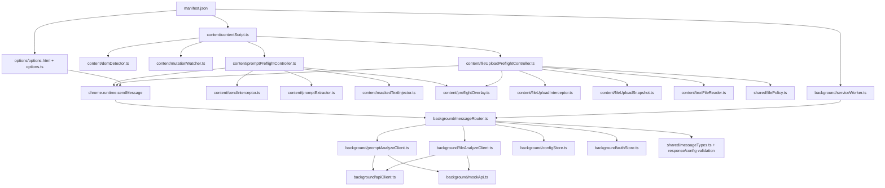
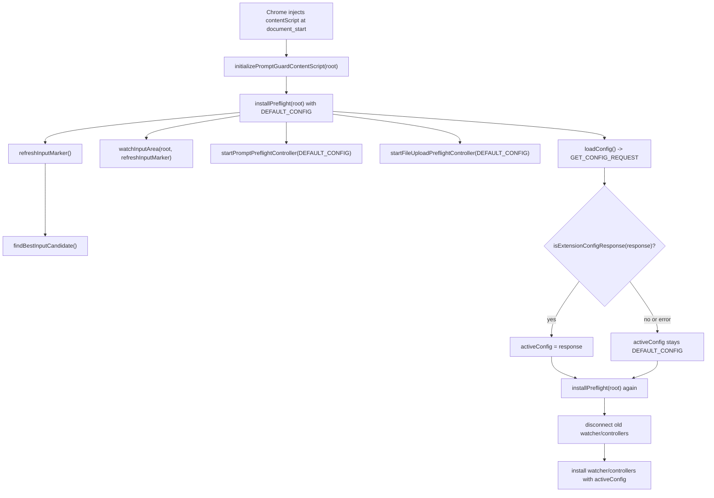
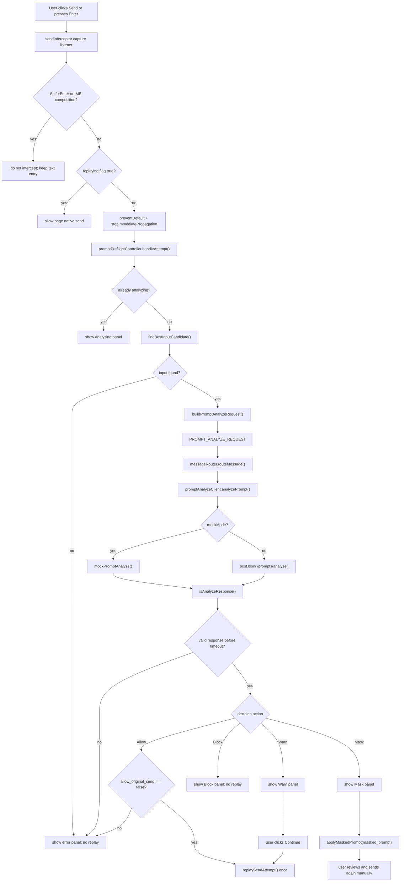
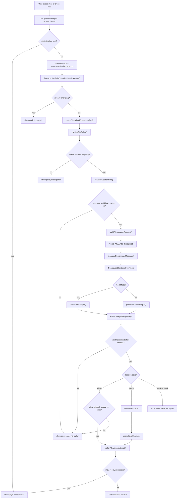
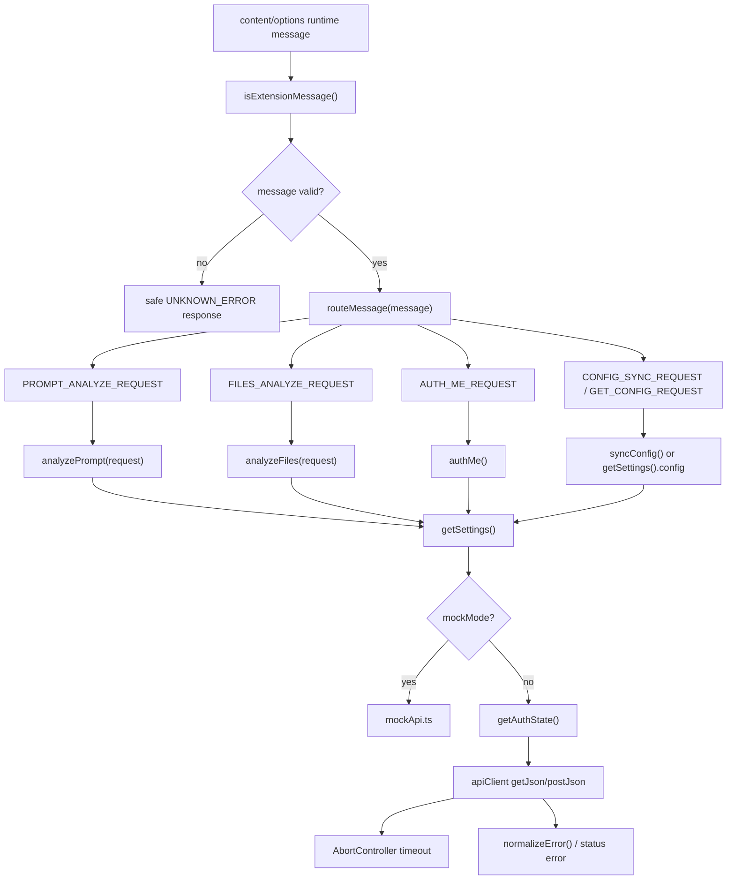
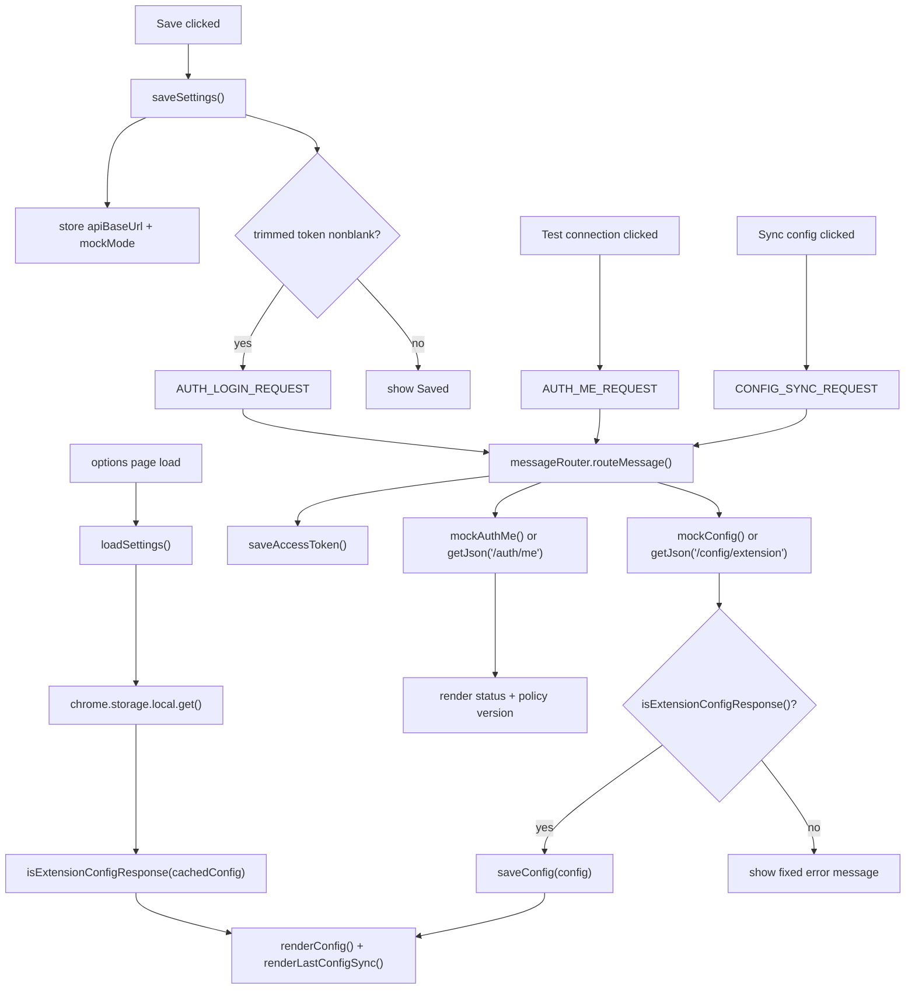

# PromptGuard Extension Implementation Status - 2026-05-22

## Purpose

This reference summarizes the current Chrome Extension MVP implementation for prompt and text-file upload preflight. It is a handoff snapshot for explaining how the implementation works and how the project is organized after the 2026-05-22 implementation slices.

## Current Delivery State

- Prompt DOM preflight is implemented for click and Enter send attempts on supported ChatGPT-like pages.
- Text-file upload DOM preflight is implemented for file input changes and file drops.
- The extension uses Manifest V3, TypeScript, Vite, Vitest, and jsdom fixture coverage.
- The content script runs at `document_start`, installs hooks immediately with default config, and reinstalls with fetched config when available.
- Analyze integration is mock-capable and routed through background service-worker clients until the real server API is ready.
- Real-mode API clients attach bearer headers for prompt/file analyze, auth check, and config sync requests, and normalize configured API base URLs before joining endpoint paths.
- Error normalization returns fixed safe messages and does not echo arbitrary thrown error text.
- The MVP intentionally does not use `webRequest` or Declarative Net Request network monitoring.

## Additional Hardening Added After Initial Prompt/File Slices

- Real API GET requests for auth check and config sync now use the stored bearer token.
- API base URL joining now tolerates a trailing slash in the configured API URL.
- API base URL storage now trims padded values and falls back to the default URL for blank stored or cached config values.
- Auth token saves now trim padded values and clear blank token writes; options input sends only trimmed nonblank tokens.
- Options page config rendering now ignores malformed cached config objects and falls back to the default config.
- Manifest host permissions include the default API origin, while content script injection remains limited to ChatGPT domains.
- Options UI now displays last config sync status.
- Runtime message guarding now rejects unknown or malformed messages before routing, including malformed prompt/file analyze request payloads at the service-worker boundary.
- Prompt/file Analyze responses must pass shared response validation before any Allow/Warn/Mask/Block controller action is applied.
- Prompt/file overlay tests verify server `user_message` text is not rendered directly, keeping user-facing messages fixed and metadata-only.
- Extension config responses must pass the shared config shape guard before cache/use/render.
- Extension config numeric limits now reject non-positive and non-finite values before cache/use/render.
- Extension config service/domain/selector and allowed-extension surfaces now reject empty lists and blank strings before cache/use/render.
- Cached config reads fall back to the default config when previously stored cache data is malformed.
- Contradictory `Allow` decisions with `allow_original_send` or `allow_original_upload` explicitly false fail closed.
- Content script loading moved to `document_start`; hooks install immediately with default config and reinstall after fetched config.
- Error normalization no longer echoes arbitrary thrown error text.
- Storage boundary tests now lock config/auth storage keys.
- Privacy regression seeds now cover prompt text, file content text, masked prompt fields, original filename variants, extracted text variants, and detected raw value variants.
- Content script request-context coverage now verifies page context uses origin only and omits URL path/query/fragment.
- E2E fixture coverage now verifies prompt and text-file hooks still work while config response is delayed.
- Text-file reading now rejects binary-looking content after reading if NUL/control-character checks fail.
- Text MIME recognition includes common `application/*` MIME values for text-oriented source/config files while still rejecting binary-oriented MIME types.
- File policy extension comparisons normalize configured allowed/excluded extension lists to lowercase.
- File type/policy tests now cover `.env` dotfiles and trailing-dot unsupported-extension handling.

## Implemented Control Flow

### Prompt Send

1. The content script finds the best prompt input candidate and watches DOM changes.
2. `sendInterceptor` holds click or Enter send attempts. Shift+Enter and IME composition Enter remain available for text entry.
3. `promptPreflightController` extracts prompt text transiently and sends `PROMPT_ANALYZE_REQUEST` to the background router.
4. The background router calls the prompt Analyze client, which can use either the mock API or configured API client.
5. Allow replays the send once only if the response authorizes original send. Warn asks for user confirmation before replay. Mask replaces the input with `masked_prompt` and does not auto-send. Block, timeout, contradictory Allow flags, and error paths fail closed.

### Text-File Upload

1. `fileUploadInterceptor` holds file input changes and file drops that contain files.
2. `fileUploadSnapshot` captures only transient File references for the current preflight operation.
3. Shared file policy rejects unsupported file categories before content reading.
4. `textFileReader` reads supported text files in memory only and rejects binary-looking decoded content.
5. `fileUploadPreflightController` sends `FILES_ANALYZE_REQUEST` with generated client file IDs, extension, MIME type, size, and transient text content. Original file names are not included.
6. Allow replays the file input change when possible only if the response authorizes original upload. Warn requires user confirmation before replay. Drop replay failure shows the reattach fallback. Block, timeout, contradictory Allow flags, read error, API error, and file Mask decisions fail closed.

## Module Map

| Area | Main files |
| --- | --- |
| Content script entry | `apps/extension/src/content/contentScript.ts` |
| Prompt DOM hook | `apps/extension/src/content/sendInterceptor.ts`, `promptPreflightController.ts`, `promptExtractor.ts`, `maskedTextInjector.ts` |
| File DOM hook | `apps/extension/src/content/fileUploadInterceptor.ts`, `fileUploadPreflightController.ts`, `fileUploadSnapshot.ts`, `textFileReader.ts` |
| Shared UI | `apps/extension/src/content/preflightOverlay.ts` |
| DOM detection | `apps/extension/src/content/domDetector.ts`, `mutationWatcher.ts` |
| Background routing | `apps/extension/src/background/serviceWorker.ts`, `messageRouter.ts` |
| Analyze clients | `apps/extension/src/background/promptAnalyzeClient.ts`, `fileAnalyzeClient.ts`, `apiClient.ts`, `mockApi.ts` |
| Configuration | `apps/extension/src/background/configStore.ts`, `authStore.ts`, `apps/extension/src/options/*` |
| Packaging/permissions | `apps/extension/manifest.json`, `apps/extension/tests/unit/manifestPermissions.test.ts` |
| Shared contracts | `apps/extension/src/shared/types.ts`, `messageTypes.ts`, `configValidation.ts`, `responseValidation.ts`, `filePolicy.ts`, `fileTypes.ts`, `sanitize.ts`, `errors.ts` |
| Tests | `apps/extension/tests/unit/*`, including options-page storage/input coverage, `apps/extension/tests/e2e/extension.spec.ts`, `apps/extension/tests/run_extension_checks.py` |

## Detailed Flowcharts and Box Explanations

### 1. Structural Module Flow



| Box | Module/function meaning | Why it exists |
| --- | --- | --- |
| `manifest.json` | Declares MV3 service worker, content script, options page, storage permission, and host permissions. | Keeps browser entry points explicit and avoids network-monitoring permissions. |
| `contentScript.ts` | `initializePromptGuardContentScript()`, `installPreflight()`, `loadConfig()`. | Installs DOM preflight hooks quickly, then refreshes them with cached/remote config. |
| `domDetector.ts` | `findBestInputCandidate()`. | Finds the best prompt input element from configured selectors. |
| `mutationWatcher.ts` | `watchInputArea()`. | Re-runs input detection when the page DOM changes. |
| `promptPreflightController.ts` | `startPromptPreflightController()`, `handleAttempt()`, `handleDecision()`. | Owns prompt send state, timeout, action handling, and guarded replay. |
| `fileUploadPreflightController.ts` | `startFileUploadPreflightController()`, `buildFilesAnalyzeRequest()`. | Owns file attach state, policy validation, text reads, Analyze request, and fallback UX. |
| `messageRouter.ts` | `routeMessage()`. | Central background boundary for content/options messages. |
| `apiClient.ts` | `postJson()`, `getJson()`, `apiUrl()`. | Centralizes real HTTP calls, bearer headers, timeout, URL joining, and safe errors. |
| `mockApi.ts` | `mockPromptAnalyze()`, `mockFilesAnalyze()`, `mockConfig()`, `mockAuthMe()`. | Lets the extension be developed and tested before the server API is ready. |
| `shared/*Validation.ts` | `isExtensionMessage()`, `isAnalyzeResponse()`, `isFilesAnalyzeResponse()`, `isExtensionConfigResponse()`. | Prevents malformed runtime/API payloads from driving DOM actions. |

### 2. Content Script Startup Flow



| Box | Module/function meaning | Operational detail |
| --- | --- | --- |
| `document_start` | `manifest.json` content script timing. | Hooks are installed early enough to protect delayed config scenarios. |
| `initializePromptGuardContentScript()` | Content script top-level initializer. | Runs default install first, then config-aware reinstall. |
| `installPreflight()` | Content script installer. | Ensures only one watcher, prompt controller, and file controller remain active. |
| `refreshInputMarker()` | Content script DOM marker helper. | Updates `document.documentElement.dataset.promptguardInputDetected`. |
| `loadConfig()` | Runtime config fetch helper. | Uses `GET_CONFIG_REQUEST`; invalid responses fall back to defaults. |
| `disconnect old watcher/controllers` | `disconnect()` methods from controllers/watchers. | Prevents duplicated hooks after config reload. |

### 3. Prompt Send Flow



| Box | Module/function meaning | Operational detail |
| --- | --- | --- |
| `sendInterceptor capture listener` | `installSendInterceptor()`. | Captures send button click and Enter before the page submits. |
| `TextEntry` | `sendInterceptor.ts` keydown guard. | Shift+Enter and IME composition Enter are not treated as send attempts. |
| `replaying flag` | `promptPreflightController.ts` local state. | Prevents extension-triggered replay from being intercepted again. |
| `handleAttempt()` | Prompt controller async flow. | Creates an attempt id, marks `analyzing`, starts timeout, and waits for Analyze response. |
| `buildPromptAnalyzeRequest()` | Prompt request builder. | Adds transient prompt text, input method, origin-only context, policy version, and generated request id. |
| `isAnalyzeResponse()` | Shared response guard. | Invalid Analyze output cannot trigger Allow/Warn/Mask/Block behavior. |
| `replaySendAttempt()` | Send interceptor helper. | Dispatches a guarded one-time send only for authorized Allow or confirmed Warn. |
| `applyMaskedPrompt()` | Mask injector. | Replaces the input value with `masked_prompt`; it does not send automatically. |
| `FailClosed` | Overlay error state. | Timeout, API error, validation error, and missing input all leave the original send blocked. |

### 4. Text-File Upload Flow



| Box | Module/function meaning | Operational detail |
| --- | --- | --- |
| `fileUploadInterceptor capture listener` | `installFileUploadInterceptor()`. | Captures file input `change` and drag/drop files before page upload handling. |
| `createFileUploadSnapshots()` | File snapshot helper. | Keeps transient `File` references and policy metadata for the current attempt. |
| `validateFilePolicy()` | Shared file policy. | Rejects disabled policy, too many files, oversized files, oversized batch, unsupported/excluded extension, and non-text MIME. |
| `readAllowedTextFiles()` | Text reader. | Reads only allowed files in memory, rejects NUL/control-heavy content as binary-looking. |
| `buildFilesAnalyzeRequest()` | File request builder. | Sends generated file ids, extension, MIME, size, transient content text, context, and policy version. Original filenames are omitted. |
| `isFilesAnalyzeResponse()` | Shared response guard. | Invalid file Analyze output cannot authorize upload replay. |
| `replayFileUploadAttempt()` | File interceptor helper. | Replays input change where possible; drop replay is treated as fallback. |
| `reattach fallback` | File controller overlay. | Tells the user to attach again when the page uploader state cannot be replayed safely. |
| `Mask or Block` | File controller decision branch. | File masking is out of MVP scope, so Mask is handled as a blocking file decision. |

### 5. Background API and Mock Routing Flow



| Box | Module/function meaning | Operational detail |
| --- | --- | --- |
| `isExtensionMessage()` | `shared/messageTypes.ts`. | Rejects malformed runtime messages before any handler runs. |
| `routeMessage()` | `background/messageRouter.ts`. | Switches message type to prompt/file/auth/config handlers. |
| `getSettings()` | `background/configStore.ts`. | Reads API base URL, mock mode, cached config, and last sync state with safe defaults. |
| `getAuthState()` | `background/authStore.ts`. | Reads bearer token only in the background/service-worker side. |
| `mockApi.ts` | Mock boundary. | Keeps test/development behavior on the same message path as real API behavior. |
| `getJson()` / `postJson()` | `background/apiClient.ts`. | Adds headers, joins URL safely, aborts on timeout, and converts failures to fixed safe messages. |

### 6. Options and Config Flow



| Box | Module/function meaning | Operational detail |
| --- | --- | --- |
| `loadSettings()` | `options/options.ts`. | Hydrates the options form from storage and renders cached config safely. |
| `saveSettings()` | `options/options.ts`. | Stores only operational settings and sends token storage through background messaging. |
| `saveAccessToken()` | `background/authStore.ts`. | Trims token and clears auth state for blank token writes. |
| `AUTH_ME_REQUEST` | Options-to-background message. | Lets the UI test either mock identity or real `/auth/me`. |
| `CONFIG_SYNC_REQUEST` | Options-to-background message. | Fetches selector, timeout, and file policy config through mock or real API. |
| `saveConfig()` | `background/configStore.ts`. | Caches only validated config and records last config sync timestamp. |

## Privacy and Non-Goals

The implementation must not persist or log raw prompt text, file content, extracted text, detected raw values, original file names, full masked prompts, or full URL path/query. Current tests and wrapper scans focus on this boundary.

Out of scope for the MVP:

- PDF parsing
- Office document parsing
- OCR
- archive extraction
- binary parsing
- malware scanning
- network monitoring through `webRequest` or DNR
- automatic send after prompt Mask
- file content masking

## Verification Snapshot

Last verified commands for the prompt/file preflight slices:

```powershell
python apps/extension/tests/run_extension_checks.py prompt-preflight
python apps/extension/tests/run_extension_checks.py file-upload-preflight
```

The file-upload wrapper currently covers typecheck, Vitest unit/E2E fixture tests, production build, static no-network-monitoring checks, static no-console checks, and generated bundle privacy seed checks. The latest run covers 21 test files and 67 tests.

## Remaining Decisions

- Replace mock Analyze behavior with the real API contract when server endpoints are ready.
- Decide whether the historical broad MVP start plan should be re-reviewed under the JavaScript wrapper oracle or left as a superseded active parent plan while completed implementation slices remain archived.
- Add browser/manual smoke coverage only when a target live page and acceptance environment are selected.
- Decide any telemetry/event schema separately, keeping metadata-only retention and the no-raw-value rule intact.
