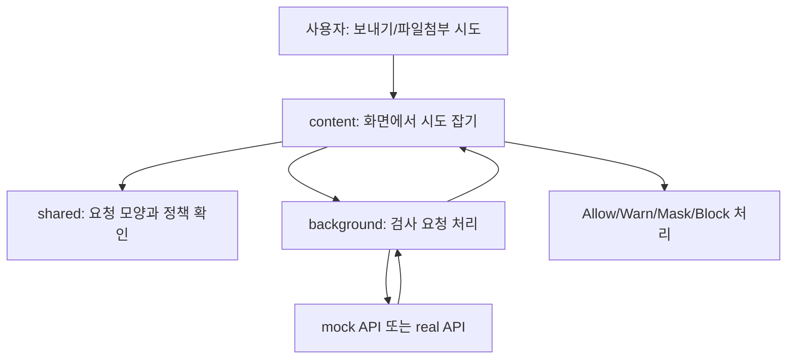
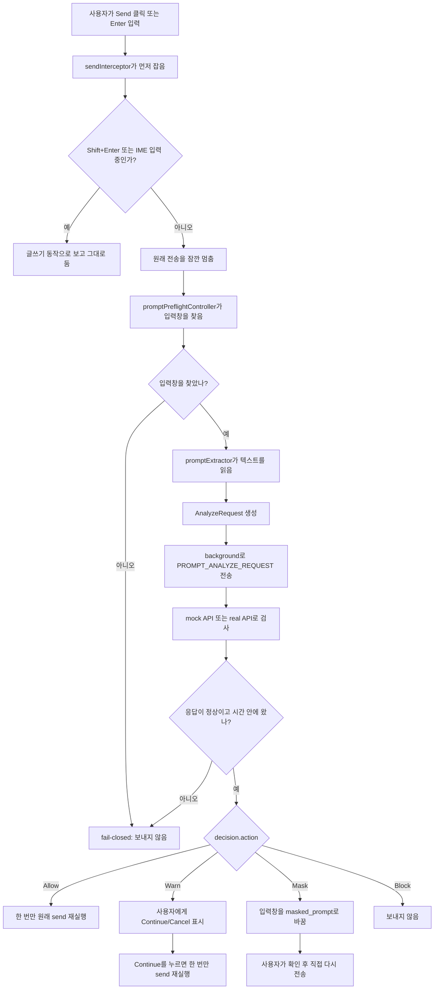
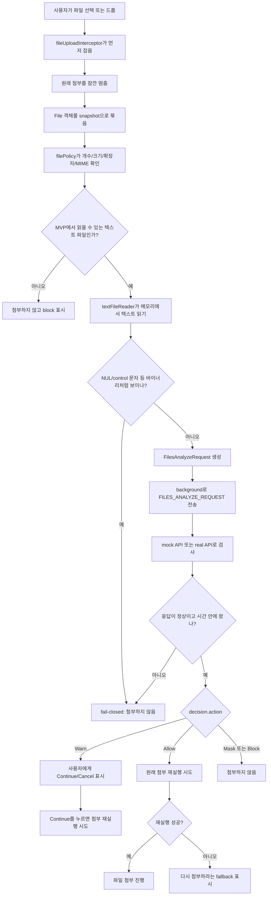
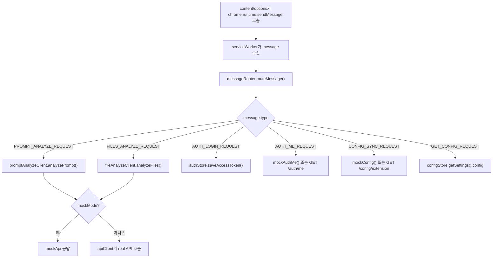
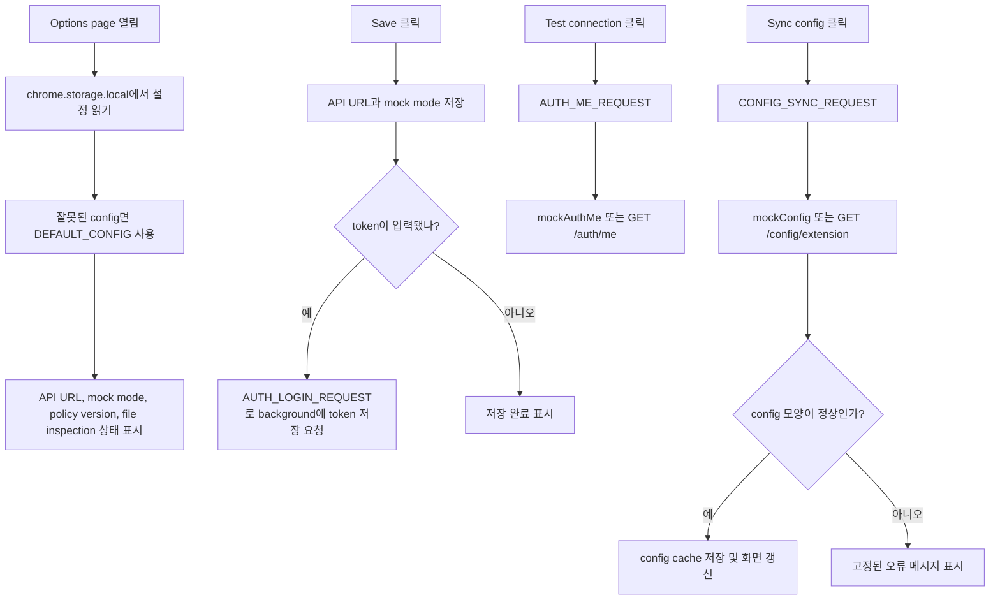
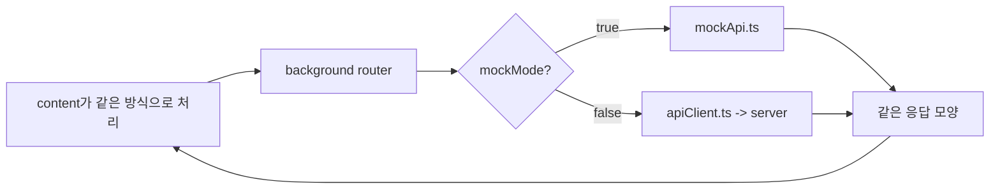
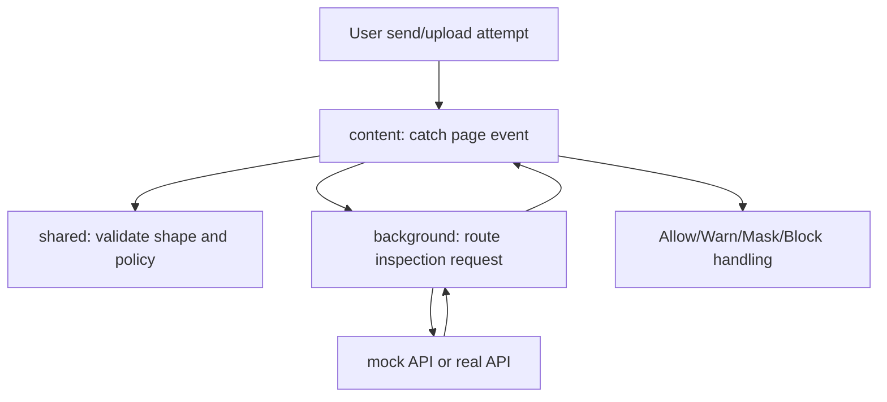
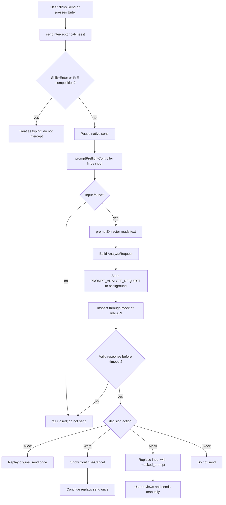
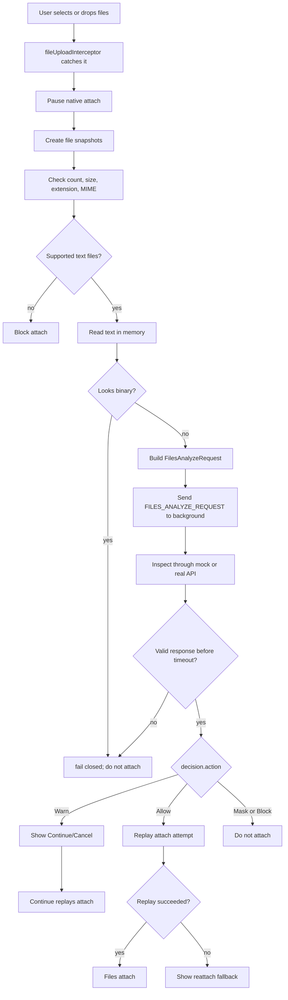
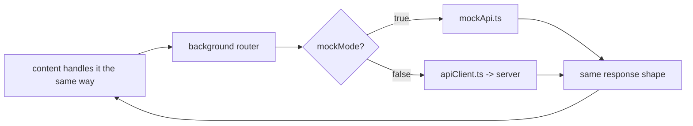

# PromptGuard Extension Implementation Status - 2026-05-22

# 한국어 섹션

## 이 문서의 목적

이 문서는 PromptGuard Chrome Extension이 현재 어디까지 만들어졌는지, 각 부분이 왜 필요한지, 실제로 어떤 데이터를 받아서 어떤 다음 단계로 넘기는지 설명한다.

PromptGuard Extension의 핵심 역할은 간단하다.

1. 사용자가 ChatGPT 같은 화면에서 프롬프트를 보내려고 한다.
2. 확장프로그램이 전송을 잠깐 멈춘다.
3. 내용을 검사 서버 또는 mock API에 보낸다.
4. 검사 결과가 돌아오면 Allow, Warn, Mask, Block 중 하나로 처리한다.
5. 문제가 없으면 원래 전송을 다시 실행하고, 문제가 있으면 사용자가 확인하거나 수정하게 한다.

파일 업로드도 같은 생각으로 동작한다.

1. 사용자가 텍스트 파일을 첨부하려고 한다.
2. 확장프로그램이 첨부를 잠깐 멈춘다.
3. 이 MVP에서 읽을 수 있는 텍스트 파일인지 먼저 확인한다.
4. 읽을 수 있는 텍스트 파일만 메모리에서 잠깐 읽어 검사 요청을 만든다.
5. 검사 결과에 따라 첨부를 계속하거나 막는다.

중요한 경계는 다음과 같다.

- PromptGuard는 `webRequest`나 DNR로 네트워크를 몰래 감시하지 않는다.
- 주 통제 방식은 DOM preflight hook이다. 즉, 사용자가 화면에서 보내기/첨부하기를 누르는 순간을 화면 안에서 잡는다.
- prompt 원문, 파일 텍스트, 추출된 텍스트, 탐지된 원본값, 원본 파일명은 저장하거나 로그로 남기지 않는다.
- Mask 결과가 오면 자동으로 다시 보내지 않는다. 입력창을 `masked_prompt`로 바꾸고 사용자가 다시 보내게 한다.
- timeout, 잘못된 응답, API 오류, 모순된 Allow 응답은 fail-closed로 처리한다. 즉, 확실히 안전하다고 확인되지 않으면 원래 전송/첨부를 계속하지 않는다.

## 현재 구현 상태 한눈에 보기

| 구분 | 현재 상태 | 이게 의미하는 것 |
| --- | --- | --- |
| Chrome Extension 구조 | 구현됨 | `manifest.json`으로 content script, background service worker, options page가 연결되어 있다. |
| Prompt 전송 검사 | 구현됨 | Send 버튼 클릭과 Enter 전송을 잡아서 검사 전에는 실제 전송이 나가지 않게 한다. |
| 텍스트 파일 업로드 검사 | 구현됨 | file input 변경과 drag/drop 파일 첨부를 잡아서 검사 전에는 실제 첨부가 진행되지 않게 한다. |
| Mock API | 구현됨 | 실제 서버 API가 없어도 같은 흐름으로 개발과 테스트를 할 수 있다. |
| Real API client | 구현됨 | 실제 서버가 준비되면 `/prompts/analyze`, `/files/analyze`, `/auth/me`, `/config/extension` 요청을 보낼 수 있다. |
| Options page | 구현됨 | API URL, token, mock mode, config sync 상태를 관리한다. |
| 응답 검증 | 구현됨 | 서버나 mock이 이상한 모양의 응답을 주면 화면 동작을 하지 않고 막는다. |
| Privacy guard | 구현 및 테스트됨 | 원문 저장/로그, 원본 파일명 전송/저장, URL path/query 저장을 피하는 방향으로 테스트가 있다. |
| 네트워크 감시 제외 | 구현 및 테스트됨 | `webRequest`, DNR 기반 감시는 MVP에 없다. |
| PDF/Office/OCR/압축/바이너리/malware scan | 제외됨 | 이번 MVP는 텍스트 기반 파일만 다룬다. |

## 실제 확장프로그램 실행 방법

### 1. 필요한 패키지 설치

저장소 루트에서 extension 폴더로 이동한다.

```powershell
cd apps/extension
npm install
```

`npm install`은 확장프로그램을 빌드하고 테스트하는 데 필요한 TypeScript, Vite, Vitest 같은 도구를 설치한다. 설치 결과물은 `apps/extension/node_modules/`에 생기며, 이 폴더는 생성물이라 git에 올리지 않는다.

### 2. 타입 검사, 테스트, 빌드 실행

```powershell
npm run typecheck
npm test
npm run build
```

각 명령의 의미는 다음과 같다.

| 명령 | 하는 일 | 성공하면 알 수 있는 것 |
| --- | --- | --- |
| `npm run typecheck` | TypeScript 타입이 맞는지 확인한다. | 코드가 서로 맞지 않는 값을 주고받는 문제가 적어도 타입 수준에서는 없다. |
| `npm test` | Vitest 테스트를 실행한다. | 주요 함수와 흐름이 예상대로 동작한다. |
| `npm run build` | Chrome이 읽을 수 있는 확장프로그램 파일을 만든다. | `apps/extension/dist/` 폴더에 실제 로드할 결과물이 생긴다. |

### 3. Chrome에 로드

1. Chrome에서 `chrome://extensions`를 연다.
2. 오른쪽 위 `Developer mode`를 켠다.
3. `Load unpacked`를 누른다.
4. `apps/extension/dist` 폴더를 선택한다.
5. ChatGPT 대상 페이지로 이동한다. 현재 manifest는 `https://chatgpt.com/*`, `https://chat.openai.com/*`에 content script를 넣는다.

### 4. Options page 설정

Chrome 확장프로그램 목록에서 PromptGuard의 options page를 연다.

| 설정 | 의미 |
| --- | --- |
| API Base URL | 실제 Analyze API를 쓸 때 요청을 보낼 서버 주소다. 기본값은 `https://promptguard.example.com/api/v1`이다. |
| Token | 실제 API에 보낼 bearer token이다. 저장은 background 쪽에서 처리한다. |
| Mock mode | 켜져 있으면 실제 서버 대신 mock API를 사용한다. 서버가 아직 준비되지 않았을 때 개발할 수 있게 해준다. |
| Test connection | mock 또는 real `/auth/me` 흐름을 확인한다. |
| Sync config | mock 또는 real `/config/extension`에서 selector, timeout, file policy 같은 설정을 받아온다. |

Mock mode가 켜져 있으면 서버 없이도 prompt/file 검사 흐름을 볼 수 있다. Real mode로 바꾸면 저장된 API URL과 token을 사용해 실제 서버로 요청한다.

### 5. 루트에서 wrapper 검사 실행

저장소 루트에서 다음 명령을 실행할 수 있다.

```powershell
python apps/extension/tests/run_extension_checks.py prompt-preflight
python apps/extension/tests/run_extension_checks.py file-upload-preflight
```

이 wrapper는 단순히 한두 테스트만 돌리는 것이 아니라, 관련 타입 검사, unit/E2E fixture 테스트, build, 정적 검사까지 묶어서 확인한다.

## 전체 구조를 한 문장으로 설명

PromptGuard Extension은 세 부분으로 나뉜다.

1. `content` 쪽은 사용자가 보고 있는 웹페이지 안에서 send/upload 시도를 잡는다.
2. `background` 쪽은 검사 요청을 mock API 또는 real API로 보낸다.
3. `shared` 쪽은 content와 background가 같은 규칙으로 메시지, 응답, 설정, 파일 정책을 확인하게 해준다.



## 폴더와 모듈이 하는 일

| 위치 | 왜 필요한가 | 받는 것 | 넘기는 것 | 결과 |
| --- | --- | --- | --- | --- |
| `manifest.json` | Chrome에게 이 확장프로그램이 어떤 파일을 언제 실행할지 알려준다. | Chrome extension 설정 | content script, service worker, options page 선언 | Chrome이 PromptGuard를 로드할 수 있다. |
| `src/content/contentScript.ts` | 페이지가 열리자마자 PromptGuard 동작을 시작한다. | 현재 페이지 DOM, 기본 config, 저장된 config | prompt controller, file controller, DOM watcher | 페이지 안에서 send/upload 감시가 시작된다. |
| `src/content/domDetector.ts` | prompt 입력창을 찾는다. | selector 목록, 현재 DOM | 가장 적합한 입력창 후보 | 검사할 입력창을 알 수 있다. |
| `src/content/mutationWatcher.ts` | 페이지 DOM이 바뀌면 다시 찾는다. | 감시할 DOM root, 다시 찾는 함수 | DOM 변경 알림 | ChatGPT 화면이 동적으로 바뀌어도 입력창을 다시 잡는다. |
| `src/content/sendInterceptor.ts` | 사용자의 send 시도를 먼저 잡는다. | click, Enter, send button selector | `SendAttempt` | 실제 전송 전에 prompt controller가 검사할 수 있다. |
| `src/content/promptExtractor.ts` | 입력창에서 텍스트를 읽는다. | textarea 또는 contenteditable element | prompt text | 검사 요청에 넣을 텍스트가 준비된다. |
| `src/content/promptPreflightController.ts` | prompt 검사 흐름의 중심이다. | send attempt, prompt text, context, config | `PROMPT_ANALYZE_REQUEST` | Allow/Warn/Mask/Block에 맞는 화면 동작을 한다. |
| `src/content/maskedTextInjector.ts` | Mask 결과를 입력창에 넣는다. | 입력창, `masked_prompt` | 변경된 입력창 | 사용자가 바뀐 내용을 보고 직접 다시 보낼 수 있다. |
| `src/content/fileUploadInterceptor.ts` | 파일 선택/드롭 시도를 먼저 잡는다. | file input change, drop event | `FileUploadAttempt` | 실제 첨부 전에 file controller가 검사할 수 있다. |
| `src/content/fileUploadSnapshot.ts` | 이번 첨부 시도에 필요한 파일 정보를 묶는다. | `File` 객체 목록 | client file id, size, MIME, 확장자 판단용 이름 | 다음 단계에서 정책 검사를 할 수 있다. |
| `src/content/textFileReader.ts` | 허용된 텍스트 파일만 메모리에서 읽는다. | file snapshot, policy decision | 검사 요청용 파일 배열 | 서버/mock에 보낼 파일 텍스트가 준비된다. |
| `src/content/fileUploadPreflightController.ts` | 파일 검사 흐름의 중심이다. | file attempt, file policy, file text, context | `FILES_ANALYZE_REQUEST` | 첨부 계속/중단/다시 첨부 안내를 처리한다. |
| `src/content/preflightOverlay.ts` | 사용자에게 검사 상태와 버튼을 보여준다. | decision, message, action buttons | 화면 overlay | 사용자가 Continue, Cancel, Retry, Apply mask를 누를 수 있다. |
| `src/background/serviceWorker.ts` | Chrome background entry point다. | runtime message | message router 호출 | content/options와 API client 사이의 통로가 열린다. |
| `src/background/messageRouter.ts` | 메시지를 종류별로 나눈다. | extension message | prompt/file/auth/config handler 호출 | 하나의 입구에서 모든 요청을 정리한다. |
| `src/background/promptAnalyzeClient.ts` | prompt 검사 요청을 처리한다. | `AnalyzeRequest` | mock result 또는 real `/prompts/analyze` 결과 | prompt decision이 돌아온다. |
| `src/background/fileAnalyzeClient.ts` | file 검사 요청을 처리한다. | `FilesAnalyzeRequest` | mock result 또는 real `/files/analyze` 결과 | file decision이 돌아온다. |
| `src/background/apiClient.ts` | 실제 HTTP 요청을 보낸다. | path, body, API URL, token, timeout | GET/POST fetch 결과 | real API 연결이 한곳에서 관리된다. |
| `src/background/mockApi.ts` | 서버 없이 답을 만들어준다. | prompt/file/auth/config 요청 | mock 응답 | 서버 준비 전에도 같은 UI 흐름을 테스트한다. |
| `src/background/configStore.ts` | 저장된 설정을 읽고 쓴다. | `chrome.storage.local` 값 | 정리된 API URL, mock mode, config | 잘못된 저장값은 기본값으로 돌아간다. |
| `src/background/authStore.ts` | token을 저장/삭제/조회한다. | options page token | background 저장 token | content script가 token을 직접 다루지 않는다. |
| `src/options/options.ts` | 설정 화면을 움직인다. | 사용자가 입력한 API URL/token/mock mode | background runtime message, storage update | 사용자가 mock/real 연결을 고를 수 있다. |
| `src/shared/types.ts` | 주고받는 데이터 모양을 정한다. | TypeScript type 정의 | content/background/options 공통 타입 | 서로 다른 파일들이 같은 약속을 사용한다. |
| `src/shared/messageTypes.ts` | runtime message가 맞는 모양인지 확인한다. | 알 수 없는 message | valid/invalid 판단 | 이상한 메시지는 background 동작을 시작하지 못한다. |
| `src/shared/responseValidation.ts` | Analyze 응답이 맞는 모양인지 확인한다. | 서버/mock 응답 | valid/invalid 판단 | 이상한 응답이 전송 replay를 허용하지 못한다. |
| `src/shared/configValidation.ts` | config 응답이 맞는 모양인지 확인한다. | cached/remote config | valid/invalid 판단 | 잘못된 config가 selector/timeout/policy로 쓰이지 않는다. |
| `src/shared/filePolicy.ts` | 파일을 읽어도 되는지 결정한다. | 파일 크기, 개수, 확장자, MIME, policy | allowed/rejected decision | MVP에서 다루지 않는 파일은 읽기 전에 막힌다. |
| `src/shared/fileTypes.ts` | 파일 확장자와 MIME을 해석한다. | 파일명, MIME type | 확장자, text-like 여부 | 텍스트처럼 보이는 파일만 다음 단계로 간다. |
| `src/shared/errors.ts` | 오류 메시지를 안전한 문장으로 바꾼다. | thrown error, fetch error | fixed safe error | 내부 오류나 민감한 내용이 화면/로그로 튀어나가지 않는다. |
| `tests/*` | 위 동작들이 깨지지 않았는지 확인한다. | 테스트 입력과 fixture page | pass/fail | 구현 변경 후 회귀를 잡는다. |

## Prompt 전송 흐름 자세히 보기



### Prompt 요청이 받는 것과 넘기는 것

`buildPromptAnalyzeRequest()`가 만드는 요청은 다음과 같은 정보를 가진다.

| 요청 안의 위치 | 들어가는 값 | 왜 필요한가 |
| --- | --- | --- |
| `prompt.text` | 입력창에서 방금 읽은 텍스트 | 검사 서버가 위험 여부를 판단하려면 내용이 필요하다. 저장용이 아니라 검사 요청용이다. |
| `prompt.input_method` | `CLICK`, `ENTER`, `UNKNOWN` | 사용자가 버튼으로 보냈는지 Enter로 보냈는지 구분한다. |
| `prompt.content_length` | 텍스트 길이 | 서버가 크기나 정책 판단에 사용할 수 있다. |
| `context.ai_service` | `CHATGPT` | 어떤 서비스 화면에서 온 요청인지 알려준다. |
| `context.ai_service_domain` | 현재 hostname | `chatgpt.com` 같은 도메인만 알려준다. |
| `context.page_url_origin` | origin만 포함한 URL | path/query/fragment를 빼서 민감한 URL 내용을 넘기지 않는다. |
| `context.extension_version` | `0.4.0` | 서버와 디버깅할 때 어떤 extension 버전인지 알 수 있다. |
| `context.browser` | `Chrome` | 브라우저 환경을 알려준다. |
| `context.locale` | 브라우저 언어 | 사용자에게 맞는 메시지나 정책에 쓸 수 있다. |
| `policy.version` | 현재 policy version | 어떤 정책 기준으로 검사했는지 맞춘다. |
| `client_request_id` | `crq...` 형태의 생성 ID | 원문을 저장하지 않고도 요청 하나를 구분할 수 있다. |

### Prompt 응답이 돌아오면 어떻게 되는가

| action | 처리 | 사용자가 보는 결과 |
| --- | --- | --- |
| `Allow` | `allow_original_send`가 false가 아닐 때만 원래 send를 한 번 재실행한다. | 메시지가 전송된다. |
| `Warn` | overlay에 Continue/Cancel을 보여준다. | Continue를 누르면 전송되고, Cancel을 누르면 멈춘다. |
| `Mask` | `masked_prompt`를 입력창에 넣는다. | 자동 전송되지 않는다. 사용자가 바뀐 문장을 보고 직접 다시 보낸다. |
| `Block` | 원래 send를 재실행하지 않는다. | 차단 메시지와 Retry/Cancel이 보인다. |
| timeout/error/invalid response | fail-closed 처리한다. | 보내지 않고 Retry/Cancel을 보여준다. |

## 텍스트 파일 업로드 흐름 자세히 보기



### 파일 검사에서 받는 것과 넘기는 것

파일 흐름은 두 단계로 나뉜다.

첫 번째 단계는 정책 검사다. 이때는 파일을 읽기 전에 먼저 겉정보를 본다.

| 값 | 어디서 오나 | 왜 필요한가 |
| --- | --- | --- |
| 파일 개수 | 사용자가 선택/드롭한 파일 목록 | 너무 많은 파일은 한 번에 검사하지 않기 위해서다. |
| 파일 크기 | `File.size` | 너무 큰 파일은 읽지 않기 위해서다. |
| 전체 크기 | 모든 파일 크기 합 | 여러 파일 합계가 너무 크면 막기 위해서다. |
| 확장자 | 파일명에서 계산 | `.txt`, `.md`, `.json` 등 허용 목록과 비교하기 위해서다. |
| MIME type | 브라우저가 주는 `File.type` | 텍스트처럼 보이는 파일인지 한 번 더 확인하기 위해서다. |

두 번째 단계는 검사 요청 생성이다. 정책을 통과한 텍스트 파일만 메모리에서 잠깐 읽는다.

| 요청 안의 위치 | 들어가는 값 | 설명 |
| --- | --- | --- |
| `files[].client_file_id` | `file...` 형태의 생성 ID | 원본 파일명 없이 파일 하나를 구분한다. |
| `files[].extension` | 정규화된 확장자 | 서버가 파일 종류별 정책을 적용할 수 있다. |
| `files[].mime_type` | MIME type 또는 기본 `text/plain` | 서버가 파일 종류를 판단할 수 있다. |
| `files[].size_bytes` | 파일 크기 | 크기 기반 정책 판단에 쓸 수 있다. |
| `files[].content_text` | 메모리에서 읽은 텍스트 | 검사 요청에만 사용한다. 저장/로그용이 아니다. |
| `context` | 서비스, 도메인, origin, 버전, 브라우저, locale | prompt 요청과 같은 문맥 정보다. |
| `policy.version` | 현재 policy version | 어떤 기준으로 검사했는지 알려준다. |
| `client_request_id` | `frq...` 형태의 생성 ID | 파일 검사 요청 하나를 구분한다. |

원본 파일명은 요청에 넣지 않는다. `client_file_id`는 원본 파일명에서 만든 hash가 아니며, 같은 파일명이라도 첨부 시도마다 새 opaque ID가 만들어진다. 서버는 이 ID와 decision metadata만으로 응답의 file result를 요청 파일에 맞춘다.

### 파일 응답이 돌아오면 어떻게 되는가

| action | 처리 | 사용자가 보는 결과 |
| --- | --- | --- |
| `Allow` | `allow_original_upload`가 false가 아닐 때만 원래 첨부를 다시 실행한다. | 첨부가 진행된다. |
| `Warn` | overlay에 Continue/Cancel을 보여준다. | Continue를 누르면 첨부 재실행을 시도한다. |
| `Block` | 원래 첨부를 재실행하지 않는다. | 첨부가 막힌다. |
| `Mask` | 파일 내용 masking은 MVP 범위 밖이므로 block처럼 처리한다. | 첨부가 막힌다. |
| timeout/error/invalid response | fail-closed 처리한다. | 첨부하지 않고 Retry/Cancel 또는 안내 메시지를 보여준다. |
| 재실행 실패 | 페이지가 파일 첨부 상태를 안전하게 되살릴 수 없을 때 | 사용자가 파일을 다시 첨부하라는 fallback을 보여준다. |

## Background와 API 흐름 자세히 보기



Background가 필요한 이유는 두 가지다.

1. content script가 웹페이지 안에서 실행되기 때문에, token/API 설정 같은 일은 background에서 관리하는 편이 안전하다.
2. prompt 검사, file 검사, auth, config sync 요청을 한곳에서 나누면 흐름이 단순해진다.

### API client가 하는 일

`apiClient.ts`는 실제 서버 요청의 공통 입구다.

| 함수 | 받는 것 | 하는 일 | 넘기는 것 |
| --- | --- | --- | --- |
| `postJson(path, body, options)` | API path, JSON body, API URL, token, timeout | POST 요청을 만든다. bearer header와 PromptGuard client header를 붙인다. | JSON 응답 또는 safe error |
| `getJson(path, options)` | API path, API URL, token, timeout | GET 요청을 만든다. bearer header와 PromptGuard client header를 붙인다. | JSON 응답 또는 safe error |
| `apiUrl(baseUrl, path)` | 기본 URL과 path | slash가 중복되거나 빠져도 정상 URL이 되도록 합친다. | 최종 URL |

서버가 401을 주면 `UNAUTHORIZED`, 500 이상이면 `SERVER_ERROR`, 그 외 처리 불가 응답은 `VALIDATION_ERROR`로 바꾼다. fetch 실패나 timeout도 고정된 안전 메시지로 바뀐다.

## Options와 설정 흐름 자세히 보기

Options page는 개발자나 사용자가 extension 동작 방식을 정하는 화면이다.



저장되는 값은 운영에 필요한 설정이다.

| 저장 key | 의미 |
| --- | --- |
| `promptguard.apiBaseUrl` | real API를 호출할 기본 주소 |
| `promptguard.accessToken` | bearer token |
| `promptguard.configCache` | 서버/mock에서 받은 extension config |
| `promptguard.lastConfigSyncAt` | 마지막 config sync 시각 |
| `promptguard.mockMode` | mock API 사용 여부 |

저장된 config가 이상한 모양이면 기본 config로 돌아간다. 숫자 제한값이 0 이하이거나 무한대 같은 값이면 유효한 config로 보지 않는다. selector/domain/extension list도 비어 있거나 blank string이면 거부한다.

## 하드닝 항목과 필요한 이유

하드닝은 “정상 상황에서는 잘 동작하고, 이상한 상황에서는 안전하게 멈추게 만드는 작업”이다.

| 항목 | 왜 필요한가 | 현재 처리 |
| --- | --- | --- |
| `document_start` 로딩 | config가 늦게 와도 사용자가 먼저 send를 누를 수 있다. | 기본 config로 hook을 먼저 설치하고, config를 받은 뒤 다시 설치한다. |
| hook 재설치 시 cleanup | 같은 이벤트를 여러 번 잡으면 send/upload가 중복 처리될 수 있다. | watcher와 controller의 `disconnect()`를 호출한 뒤 새로 설치한다. |
| runtime message guard | 외부나 버그로 이상한 메시지가 들어오면 background가 잘못 움직일 수 있다. | message shape를 확인하고 맞지 않으면 거부한다. |
| Analyze response validation | 서버 응답이 깨졌는데 Allow처럼 처리하면 위험하다. | response guard를 통과한 응답만 action으로 처리한다. |
| Config validation | 잘못된 selector/timeout/file policy는 보호 흐름을 망가뜨린다. | cache/use/render 전에 config 모양을 검사한다. |
| timeout fail-closed | 검사 서버가 늦거나 멈췄을 때 원래 전송이 그냥 나가면 안 된다. | timeout이면 send/upload를 계속하지 않는다. |
| 모순된 Allow 차단 | action은 Allow인데 `allow_original_send` 또는 `allow_original_upload`가 false일 수 있다. | 이런 응답은 Allow로 보지 않고 fail-closed 처리한다. |
| replay flag | extension이 허용 후 재실행한 send/upload를 다시 extension이 잡으면 무한 반복될 수 있다. | replay 중에는 interceptor가 통과시킨다. |
| fixed safe message | 서버가 준 문장이나 thrown error에 민감한 내용이 있을 수 있다. | 사용자에게는 고정된 안전 메시지를 보여준다. |
| origin-only context | 전체 URL에는 대화 ID나 query가 있을 수 있다. | `window.location.origin`만 넘긴다. |
| 파일 정책 선검사 | 읽지 말아야 할 파일을 읽은 뒤 막으면 늦다. | 개수/크기/확장자/MIME을 먼저 확인한다. |
| binary-looking check | 확장자가 텍스트여도 실제 내용이 바이너리일 수 있다. | NUL/control 문자 비율로 다시 막는다. |
| 원본 파일명 제외 | 파일명 자체가 민감한 정보일 수 있다. | Analyze request에 원본 파일명을 넣지 않는다. |
| network monitoring 제외 | MVP 통제 방식이 DOM preflight이므로 브라우저 네트워크 감시 권한이 필요 없다. | manifest와 source에서 `webRequest`/DNR을 쓰지 않는다. |

## Privacy와 저장 금지 경계

PromptGuard가 검사하려면 전송 직전의 텍스트를 잠깐 다뤄야 한다. 하지만 “잠깐 다룬다”와 “저장한다”는 다르다.

현재 구현 원칙은 다음과 같다.

| 값 | 검사에 사용되는가 | 저장/로그되는가 | 설명 |
| --- | --- | --- | --- |
| prompt 텍스트 | 예 | 아니오 | Analyze 요청에 잠깐 들어가지만 저장하지 않는다. |
| 텍스트 파일 내용 | 예 | 아니오 | 허용된 텍스트 파일만 메모리에서 읽어 검사 요청에 넣는다. |
| 원본 파일명 | 정책 판단에는 사용 | 아니오 | 확장자 계산에는 필요하지만 요청에는 넣지 않는다. |
| URL origin | 예 | 운영 설정 수준 | path/query/fragment를 제외한 origin만 사용한다. |
| masked prompt 전체 | 화면 치환에 사용 | 아니오 | 입력창을 바꾸는 데만 사용한다. |
| 탐지된 원본값 | 서버 응답에 들어오더라도 렌더링/로그 금지 | 아니오 | UI는 metadata 중심의 안전 메시지를 사용한다. |

## Mock API와 Real API를 같이 둔 이유

서버 API가 아직 준비되지 않았을 때도 extension 쪽 개발은 진행되어야 한다. 그래서 mock API가 있다.

Mock API는 “가짜 길”이 아니라 “같은 길에서 마지막 응답만 가짜로 만드는 방식”이다.



이 구조 덕분에 서버가 준비되기 전에는 mock으로 UI와 흐름을 만들고, 서버가 준비되면 mode만 바꿔 real API를 붙일 수 있다.

## 테스트와 검증 상태

현재 wrapper 기준으로 prompt/file preflight 검사는 다음을 확인한다.

| 검사 | 확인하는 것 |
| --- | --- |
| TypeScript typecheck | 타입이 서로 맞는지 |
| Vitest unit tests | 각 함수와 모듈이 기대대로 동작하는지 |
| E2E fixture tests | ChatGPT 비슷한 테스트 페이지에서 send/upload 흐름이 동작하는지 |
| production build | Chrome에 올릴 `dist`가 만들어지는지 |
| no network monitoring static check | `webRequest`/DNR을 쓰지 않는지 |
| no console static check | 불필요한 console 로그가 남지 않는지 |
| privacy seed check | 원문/파일명/탐지 원본값 같은 금지 seed가 bundle에 들어가지 않는지 |
| exported surface documentation check | exported TypeScript 함수, interface, type, constant 등에 JSDoc/TSDoc 설명이 붙어 있는지 |
| audit event unit test | metadata-only audit event가 prompt/file 원문, 파일명, 서버 메시지를 포함하지 않는지 |

마지막 구현 스냅샷 기준 wrapper는 23개 test file, 70개 test를 포함한다.

## 아직 남은 결정

- 실제 Analyze 서버 API contract가 준비되면 mock 응답과 real 응답의 최종 필드 합의를 맞춰야 한다.
- live ChatGPT 페이지에서 manual smoke test를 할지, 어떤 환경에서 할지 정해야 한다.
- telemetry/event schema는 Extension MVP 기준 metadata-only audit event builder로 확정됐다. persistent logging, retention, dashboard ingestion은 실제 서버/API 계약과 함께 별도 검증한다.
- client file identity는 MVP 기준 확정됐다. filename hash를 만들지 않고, 첨부 시도마다 생성되는 opaque `client_file_id`만 사용한다.
- 파일 masking은 MVP 범위 밖이다. 필요하면 별도 범위와 UX를 정해야 한다.
- PDF, Office, OCR, 압축파일, 바이너리, malware scan은 이번 MVP 밖이다. 필요하면 별도 계획이 필요하다.

# English Section

## Purpose

This document explains what has been implemented in the PromptGuard Chrome Extension, why each part exists, what each part receives, what it passes forward, and how the extension is run.

The extension's main job is:

1. A user tries to send a prompt on a ChatGPT-like page.
2. The extension pauses the send attempt.
3. The extension sends the content to the Analyze path, using either the mock API or the real API client.
4. The Analyze path returns Allow, Warn, Mask, or Block.
5. The extension either replays the original send, asks the user to confirm, replaces the input with `masked_prompt`, or blocks the send.

File upload inspection follows the same idea:

1. A user selects or drops text files.
2. The extension pauses the attach attempt.
3. The extension checks whether the files are supported by the MVP file policy.
4. Supported text files are read in memory only for the inspection request.
5. The Analyze result decides whether the attach attempt continues or is blocked.

Important boundaries:

- The MVP does not use `webRequest` or DNR network monitoring.
- The main control path is DOM preflight hooking.
- Prompt text, file text, extracted text, detected raw values, and original filenames must not be persisted or logged.
- A Mask response does not auto-send. It replaces the input with `masked_prompt`, then the user sends again manually.
- Timeout, malformed response, API error, and contradictory Allow responses fail closed.

## Current Implementation At A Glance

| Area | Status | Meaning |
| --- | --- | --- |
| Chrome Extension structure | Implemented | `manifest.json` connects the content script, background service worker, and options page. |
| Prompt send inspection | Implemented | Send button clicks and Enter sends are intercepted before the page sends the prompt. |
| Text-file upload inspection | Implemented | File input changes and drag/drop file attempts are intercepted before the page attaches files. |
| Mock API | Implemented | Development and testing can continue before the real server API is ready. |
| Real API client | Implemented | The extension can call `/prompts/analyze`, `/files/analyze`, `/auth/me`, and `/config/extension`. |
| Options page | Implemented | API URL, token, mock mode, and config sync state are managed through the UI. |
| Response validation | Implemented | Malformed mock/server responses cannot drive DOM actions. |
| Privacy guard | Implemented and tested | Tests cover no raw persistence, no original filename request usage, and origin-only page context. |
| Network monitoring exclusion | Implemented and tested | `webRequest` and DNR are not part of the MVP. |
| PDF/Office/OCR/archive/binary/malware scan | Out of scope | The MVP handles text-based files only. |

## How To Run The Extension

### 1. Install packages

From the repository root:

```powershell
cd apps/extension
npm install
```

`npm install` installs TypeScript, Vite, Vitest, and the other build/test tools. The generated `apps/extension/node_modules/` directory is not committed.

### 2. Run checks and build

```powershell
npm run typecheck
npm test
npm run build
```

| Command | What it does | What success means |
| --- | --- | --- |
| `npm run typecheck` | Checks TypeScript types. | The modules exchange values that match their declared shapes. |
| `npm test` | Runs Vitest tests. | The main functions and flows behave as expected. |
| `npm run build` | Builds Chrome-loadable files. | `apps/extension/dist/` is created. |

### 3. Load in Chrome

1. Open `chrome://extensions`.
2. Turn on `Developer mode`.
3. Click `Load unpacked`.
4. Select `apps/extension/dist`.
5. Open a target ChatGPT page. The manifest injects the content script into `https://chatgpt.com/*` and `https://chat.openai.com/*`.

### 4. Configure the options page

Open the PromptGuard options page from Chrome's extension list.

| Setting | Meaning |
| --- | --- |
| API Base URL | The server base URL used in real API mode. The default is `https://promptguard.example.com/api/v1`. |
| Token | The bearer token used for real API calls. The background side stores it. |
| Mock mode | When enabled, the extension uses the mock API instead of the real server. |
| Test connection | Runs the mock or real `/auth/me` flow. |
| Sync config | Fetches selectors, timeout, and file policy through mock or real `/config/extension`. |

### 5. Run wrapper checks

From the repository root:

```powershell
python apps/extension/tests/run_extension_checks.py prompt-preflight
python apps/extension/tests/run_extension_checks.py file-upload-preflight
```

These wrappers combine typecheck, related unit/E2E fixture tests, build, and static checks.

## System Shape

PromptGuard Extension has three main areas:

1. `content` runs inside the web page and catches send/upload attempts.
2. `background` routes inspection requests to mock or real API clients.
3. `shared` keeps message, response, config, file policy, and error rules consistent.



## Module Guide

| Location | Why it exists | Receives | Passes forward | Result |
| --- | --- | --- | --- | --- |
| `manifest.json` | Tells Chrome what to run and where. | Extension configuration | Content script, service worker, options page declarations | Chrome can load PromptGuard. |
| `src/content/contentScript.ts` | Starts PromptGuard on the page. | DOM, default config, stored config | Prompt controller, file controller, DOM watcher | Send/upload monitoring starts. |
| `src/content/domDetector.ts` | Finds the prompt input. | Selectors and DOM | Best input candidate | The extension knows what to inspect. |
| `src/content/mutationWatcher.ts` | Re-checks the DOM after page changes. | DOM root and refresh callback | DOM change notifications | Dynamic pages remain covered. |
| `src/content/sendInterceptor.ts` | Catches send attempts first. | Click, Enter, send button selectors | `SendAttempt` | The prompt can be inspected before sending. |
| `src/content/promptExtractor.ts` | Reads text from the input. | textarea or contenteditable element | Prompt text | The Analyze request can be built. |
| `src/content/promptPreflightController.ts` | Owns the prompt inspection flow. | Send attempt, prompt text, context, config | `PROMPT_ANALYZE_REQUEST` | Applies Allow/Warn/Mask/Block behavior. |
| `src/content/maskedTextInjector.ts` | Applies Mask output to the input. | Input element and `masked_prompt` | Updated input | The user can review and resend manually. |
| `src/content/fileUploadInterceptor.ts` | Catches file attach attempts first. | File input change and drop event | `FileUploadAttempt` | Files can be inspected before attaching. |
| `src/content/fileUploadSnapshot.ts` | Groups data for the current attach attempt. | `File` objects | client file id, size, MIME, name for extension calculation | File policy can run. |
| `src/content/textFileReader.ts` | Reads only allowed text files in memory. | File snapshots and policy decisions | Request file entries | File inspection can run. |
| `src/content/fileUploadPreflightController.ts` | Owns the file inspection flow. | File attempt, file policy, file text, context | `FILES_ANALYZE_REQUEST` | Handles continue, block, or reattach fallback. |
| `src/content/preflightOverlay.ts` | Shows inspection state and buttons. | Decision, message, action buttons | Overlay UI | The user can continue, cancel, retry, or apply mask. |
| `src/background/serviceWorker.ts` | Background entry point. | Runtime messages | Message router call | Content/options can reach API clients. |
| `src/background/messageRouter.ts` | Splits messages by type. | Extension message | Prompt/file/auth/config handlers | One background entry handles all request kinds. |
| `src/background/promptAnalyzeClient.ts` | Handles prompt analysis. | `AnalyzeRequest` | Mock result or real `/prompts/analyze` result | Prompt decision returns. |
| `src/background/fileAnalyzeClient.ts` | Handles file analysis. | `FilesAnalyzeRequest` | Mock result or real `/files/analyze` result | File decision returns. |
| `src/background/apiClient.ts` | Sends real HTTP requests. | path, body, API URL, token, timeout | GET/POST fetch result | Real API behavior is centralized. |
| `src/background/mockApi.ts` | Creates server-like responses without a server. | prompt/file/auth/config requests | mock responses | The same UI path can be tested before server readiness. |
| `src/background/configStore.ts` | Reads and writes settings. | `chrome.storage.local` values | normalized API URL, mock mode, config | Invalid stored values fall back safely. |
| `src/background/authStore.ts` | Stores and reads tokens. | options page token | background-side token state | The content script does not directly handle tokens. |
| `src/options/options.ts` | Drives the settings UI. | API URL, token, mock mode from the user | background messages and storage updates | The user can choose mock or real API behavior. |
| `src/shared/types.ts` | Defines shared data shapes. | TypeScript type definitions | Common contracts | Modules use the same message/request/response shapes. |
| `src/shared/messageTypes.ts` | Checks runtime message shape. | Unknown messages | valid/invalid result | Bad messages are rejected before handlers run. |
| `src/shared/responseValidation.ts` | Checks Analyze response shape. | Mock/server response | valid/invalid result | Bad responses cannot authorize replay. |
| `src/shared/configValidation.ts` | Checks config shape. | cached/remote config | valid/invalid result | Bad config is not used. |
| `src/shared/filePolicy.ts` | Decides whether files may be read. | file size, count, extension, MIME, policy | allow/reject decision | Unsupported files are blocked before reading. |
| `src/shared/fileTypes.ts` | Interprets extensions and MIME types. | filename and MIME type | extension and text-like decision | Only likely text files continue. |
| `src/shared/errors.ts` | Converts errors to safe fixed messages. | thrown/fetch errors | normalized errors | Internal or sensitive error text is not surfaced. |
| `tests/*` | Checks behavior after changes. | test inputs and fixture pages | pass/fail | Regressions are caught. |

## Prompt Send Flow



## Text-File Upload Flow



## Hardening

| Item | Why it is needed | Current behavior |
| --- | --- | --- |
| `document_start` loading | The user may send before config finishes loading. | Hooks install with default config first, then reinstall with fetched config. |
| cleanup on reinstall | Duplicate hooks could process one send/upload more than once. | Old watcher/controllers are disconnected before reinstall. |
| runtime message guard | Bad messages should not drive background behavior. | Message shape is checked before routing. |
| Analyze response validation | Bad server/mock output must not authorize replay. | Only validated responses reach decision handling. |
| Config validation | Bad selectors, timeout, or file policy can break protection. | Config is validated before cache/use/render. |
| timeout fail-closed | Slow or unavailable inspection must not let the original action continue. | Timeout blocks send/upload. |
| contradictory Allow rejection | `Allow` with explicit false authorization is not safe. | It is treated as fail-closed. |
| replay flag | Extension-triggered replay must not be intercepted again. | Replay bypasses the interceptor once. |
| fixed safe message | Server/user/error text can contain sensitive details. | UI uses fixed safe messages. |
| origin-only context | Full URLs may contain sensitive path/query data. | Only `window.location.origin` is sent. |
| file policy before reading | Unsupported files should not be read first. | Count, size, extension, and MIME are checked before reading. |
| binary-looking check | A file can have a text extension but binary content. | NUL/control-character checks reject it. |
| original filename exclusion | Filenames may contain sensitive information. | Analyze file requests do not include original filenames. |
| opaque file identity | Stable filename hashes would create unnecessary identifiers. | File results use per-attempt `client_file_id` values, not filename-derived hashes. |
| network monitoring exclusion | The MVP uses DOM preflight, not browser network interception. | `webRequest` and DNR are not used. |

## Privacy Boundary

| Value | Used for inspection? | Persisted/logged? | Notes |
| --- | --- | --- | --- |
| Prompt text | Yes | No | Used only to build the transient Analyze request. |
| Text-file content | Yes | No | Read in memory for supported text files only. |
| Original filename | Used for policy calculation | No | Extension calculation uses the name, but the request omits the original filename. |
| Filename hash | No | No | The extension uses opaque per-attempt `client_file_id` values instead. |
| URL origin | Yes | Operational context only | Path, query, and fragment are omitted. |
| Full masked prompt | Used to replace input | No | Applied to the page input only. |
| Detected raw values | No UI/log rendering | No | UI uses fixed safe messages and metadata-style summaries. |

## Mock API And Real API

Mock mode keeps the same message path and changes only the final responder.



This lets the extension UI and control flow be developed before the server is ready. When the server is ready, mock mode can be disabled and the real API URL/token can be used.

## Verification Snapshot

The prompt/file preflight wrapper checks cover:

| Check | What it confirms |
| --- | --- |
| TypeScript typecheck | Type contracts still line up. |
| Vitest unit tests | Functions and modules behave as expected. |
| E2E fixture tests | Prompt/file flows work on a ChatGPT-like fixture page. |
| production build | The extension can be built into `dist`. |
| no network monitoring static check | `webRequest`/DNR are not used. |
| no console static check | Unwanted console logging is absent. |
| privacy seed check | Forbidden raw-value seeds are not present in generated bundles. |
| exported surface documentation check | Exported TypeScript functions, interfaces, types, constants, and similar surfaces have JSDoc/TSDoc comments. |
| audit event unit test | Metadata-only audit events do not include prompt/file raw text, filenames, or server message text. |

The latest implementation snapshot covers 23 test files and 70 tests through the wrapper path.

## Remaining Decisions

- Finalize the real Analyze API contract when the server endpoints are ready.
- Decide the live-page manual smoke test target and acceptance environment.
- Telemetry/event schema is fixed for the extension MVP as metadata-only audit event builders. Persistent logging, retention, and dashboard ingestion remain server/API integration work.
- Client file identity is fixed for the MVP: no filename hash is created, and only opaque per-attempt `client_file_id` values are used.
- Keep file content masking out of the MVP unless a separate scope and UX are approved.
- Keep PDF, Office, OCR, archives, binary parsing, and malware scan out of the MVP unless a separate plan is created.
