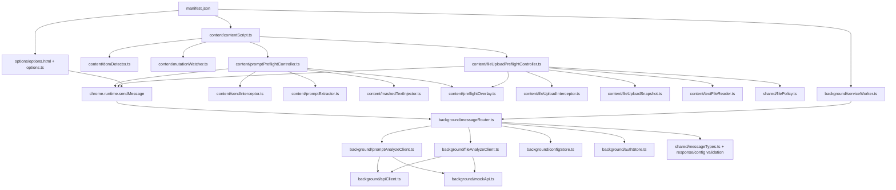
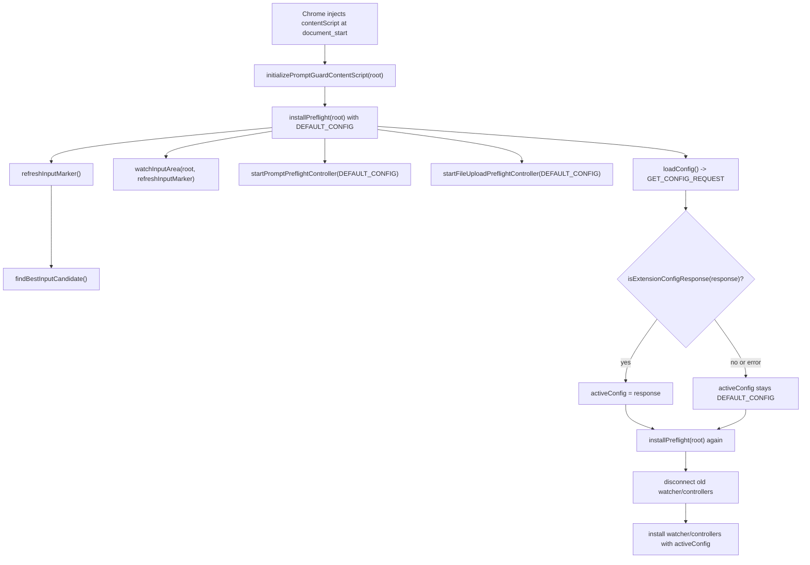
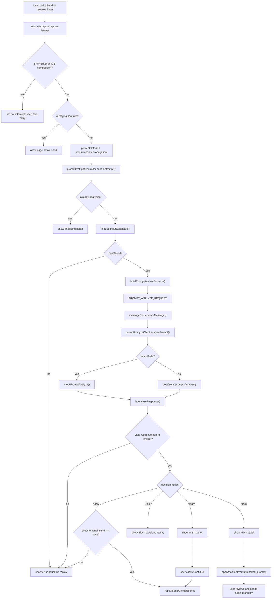
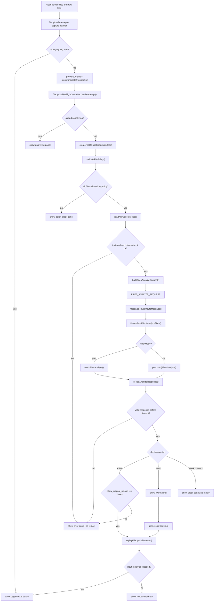
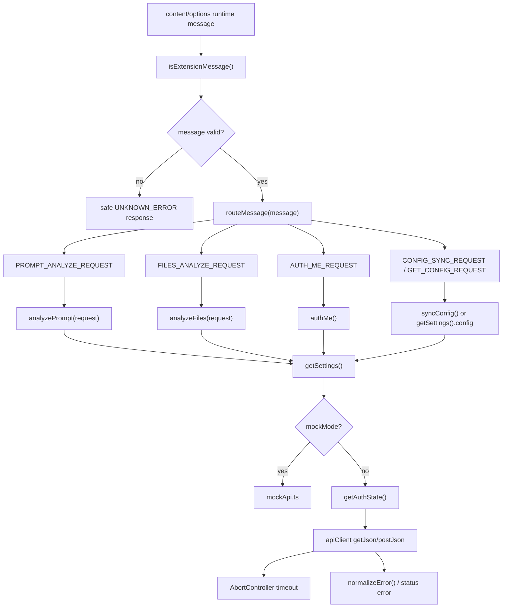
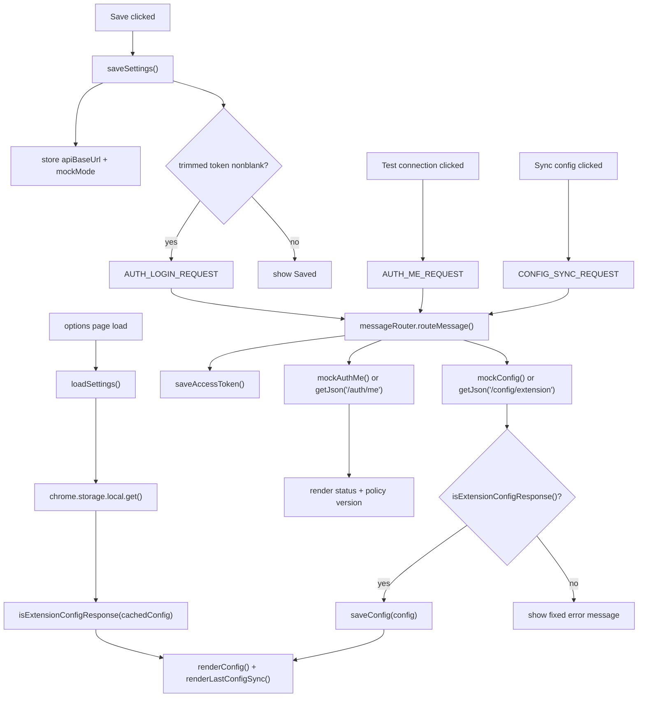

# PromptGuard Extension Implementation Status - 2026-05-22

# 한국어 섹션

## 목적

이 레퍼런스는 prompt 전송과 텍스트 기반 파일 업로드를 전송 전에 검사하는 PromptGuard Chrome Extension MVP의 현재 구현 상태를 요약한다. 2026-05-22 구현 작업 이후, 구현이 어떻게 동작하는지와 프로젝트가 어떤 구조로 되어 있는지를 팀원에게 설명하기 위한 핸드오프 스냅샷이다.

## 현재 구현 상태

- 지원되는 ChatGPT 유사 페이지에서 click과 Enter 전송 시도를 잡는 prompt DOM preflight가 구현되어 있다.
- file input change와 file drop을 잡는 텍스트 파일 업로드 DOM preflight가 구현되어 있다.
- Extension은 Manifest V3, TypeScript, Vite, Vitest, jsdom fixture coverage를 사용한다.
- content script는 `document_start`에 실행되고, 기본 config로 hook을 즉시 설치한 뒤 config를 가져오면 다시 설치한다.
- Analyze 연동은 background service worker client를 통해 라우팅되며, real server API가 준비되기 전까지 mock API로 개발할 수 있다.
- real mode API client는 prompt/file analyze, auth check, config sync 요청에 bearer header를 붙이고, endpoint path와 결합하기 전에 API base URL을 정규화한다.
- error normalization은 고정된 안전 메시지를 반환하며, 임의의 thrown error text를 그대로 노출하지 않는다.
- MVP는 `webRequest` 또는 Declarative Net Request 기반 네트워크 감시를 사용하지 않는다.

## 초기 Prompt/File Slice 이후 추가된 하드닝

- auth check와 config sync용 real API GET 요청이 저장된 bearer token을 사용한다.
- API base URL 결합은 설정된 API URL 끝에 slash가 있어도 정상 동작한다.
- API base URL 저장은 공백을 trim하고, blank stored value 또는 cached config value는 default URL로 fallback한다.
- auth token 저장은 공백을 trim하고 blank token write는 auth state를 clear한다. options input은 trim된 nonblank token만 보낸다.
- options page config rendering은 malformed cached config object를 무시하고 default config로 fallback한다.
- manifest host permissions에는 default API origin이 포함되지만, content script injection은 ChatGPT domain으로 제한된다.
- options UI는 last config sync status를 표시한다.
- runtime message guard는 service worker boundary에서 unknown 또는 malformed message를 routing 전에 reject한다. malformed prompt/file analyze request payload도 포함된다.
- Prompt/file Analyze response는 controller action을 적용하기 전에 shared response validation을 통과해야 한다.
- Prompt/file overlay test는 server `user_message` text가 직접 렌더링되지 않는지 검증한다. 사용자에게 보이는 메시지는 fixed safe message와 metadata-only 방식으로 유지한다.
- Extension config response는 cache/use/render 전에 shared config shape guard를 통과해야 한다.
- Extension config numeric limit은 non-positive 또는 non-finite value를 cache/use/render 전에 reject한다.
- Extension config service/domain/selector와 allowed-extension surface는 empty list와 blank string을 reject한다.
- cached config read는 이전에 저장된 cache data가 malformed인 경우 default config로 fallback한다.
- `allow_original_send` 또는 `allow_original_upload`가 명시적으로 false인 모순된 `Allow` decision은 fail-closed 처리한다.
- content script loading은 `document_start`로 이동했다. hook은 default config로 즉시 설치되고, fetched config 이후 다시 설치된다.
- error normalization은 임의의 thrown error text를 echo하지 않는다.
- storage boundary test는 config/auth storage key를 고정한다.
- privacy regression seed는 prompt text, file content text, masked prompt field, original filename variant, extracted text variant, detected raw value variant를 포함한다.
- content script request-context coverage는 page context가 origin만 사용하고 URL path/query/fragment를 생략하는지 검증한다.
- E2E fixture coverage는 config response가 지연되어도 prompt와 text-file hook이 동작하는지 검증한다.
- text-file reading은 NUL/control-character check 실패 시 binary-looking content로 보고 reject한다.
- text MIME recognition은 text-oriented source/config file에 흔한 `application/*` MIME value를 포함하면서 binary-oriented MIME type은 reject한다.
- file policy extension 비교는 configured allowed/excluded extension list를 lowercase로 normalize한다.
- file type/policy test는 `.env` dotfile과 trailing-dot unsupported-extension 처리를 포함한다.

## 구현된 Control Flow

### Prompt Send

1. content script가 best prompt input candidate를 찾고 DOM 변경을 감시한다.
2. `sendInterceptor`가 click 또는 Enter send attempt를 보류한다. Shift+Enter와 IME composition 중 Enter는 text entry로 그대로 둔다.
3. `promptPreflightController`가 prompt text를 transient하게 추출하고 `PROMPT_ANALYZE_REQUEST`를 background router로 보낸다.
4. background router는 prompt Analyze client를 호출한다. 이 client는 mock API 또는 configured API client를 사용할 수 있다.
5. Allow는 response가 original send를 authorize할 때만 send를 한 번 replay한다. Warn은 사용자 확인 후 replay한다. Mask는 input을 `masked_prompt`로 치환하고 자동 전송하지 않는다. Block, timeout, contradictory Allow flag, error path는 fail-closed 처리한다.

### Text-File Upload

1. `fileUploadInterceptor`가 file input change와 file이 포함된 file drop을 보류한다.
2. `fileUploadSnapshot`은 현재 preflight operation에 필요한 transient File reference만 capture한다.
3. shared file policy는 content reading 전에 unsupported file category를 reject한다.
4. `textFileReader`는 supported text file만 memory에서 읽고, binary-looking decoded content를 reject한다.
5. `fileUploadPreflightController`는 generated client file ID, extension, MIME type, size, transient text content를 포함한 `FILES_ANALYZE_REQUEST`를 보낸다. original file name은 포함하지 않는다.
6. Allow는 response가 original upload를 authorize할 때만 가능한 경우 file input change를 replay한다. Warn은 사용자 확인 후 replay한다. drop replay failure는 reattach fallback을 보여준다. Block, timeout, contradictory Allow flag, read error, API error, file Mask decision은 fail-closed 처리한다.

## Module Map

| 영역 | 주요 파일 |
| --- | --- |
| Content script entry | `apps/extension/src/content/contentScript.ts` |
| Prompt DOM hook | `apps/extension/src/content/sendInterceptor.ts`, `promptPreflightController.ts`, `promptExtractor.ts`, `maskedTextInjector.ts` |
| File DOM hook | `apps/extension/src/content/fileUploadInterceptor.ts`, `fileUploadPreflightController.ts`, `fileUploadSnapshot.ts`, `textFileReader.ts` |
| Shared UI | `apps/extension/src/content/preflightOverlay.ts` |
| DOM detection | `apps/extension/src/content/domDetector.ts`, `mutationWatcher.ts` |
| Background routing | `apps/extension/src/background/serviceWorker.ts`, `messageRouter.ts` |
| Analyze clients | `apps/extension/src/background/promptAnalyzeClient.ts`, `fileAnalyzeClient.ts`, `apiClient.ts`, `mockApi.ts` |
| Configuration | `apps/extension/src/background/configStore.ts`, `authStore.ts`, `apps/extension/src/options/*` |
| Packaging/permissions | `apps/extension/manifest.json`, `apps/extension/tests/unit/manifestPermissions.test.ts` |
| Shared contracts | `apps/extension/src/shared/types.ts`, `messageTypes.ts`, `configValidation.ts`, `responseValidation.ts`, `filePolicy.ts`, `fileTypes.ts`, `sanitize.ts`, `errors.ts` |
| Tests | `apps/extension/tests/unit/*`, options-page storage/input coverage, `apps/extension/tests/e2e/extension.spec.ts`, `apps/extension/tests/run_extension_checks.py` |

## 상세 Flowchart와 박스 설명

### 1. Structural Module Flow



| 박스 | 모듈/함수 의미 | 존재 이유 |
| --- | --- | --- |
| `manifest.json` | MV3 service worker, content script, options page, storage permission, host permission을 선언한다. | browser entry point를 명확히 하고 network-monitoring permission을 피한다. |
| `contentScript.ts` | `initializePromptGuardContentScript()`, `installPreflight()`, `loadConfig()`. | DOM preflight hook을 빠르게 설치하고 cached/remote config로 갱신한다. |
| `domDetector.ts` | `findBestInputCandidate()`. | configured selector에서 가장 적합한 prompt input element를 찾는다. |
| `mutationWatcher.ts` | `watchInputArea()`. | page DOM이 바뀌면 input detection을 다시 수행한다. |
| `promptPreflightController.ts` | `startPromptPreflightController()`, `handleAttempt()`, `handleDecision()`. | prompt send state, timeout, action handling, guarded replay를 담당한다. |
| `fileUploadPreflightController.ts` | `startFileUploadPreflightController()`, `buildFilesAnalyzeRequest()`. | file attach state, policy validation, text read, Analyze request, fallback UX를 담당한다. |
| `messageRouter.ts` | `routeMessage()`. | content/options message의 중앙 background boundary다. |
| `apiClient.ts` | `postJson()`, `getJson()`, `apiUrl()`. | real HTTP call, bearer header, timeout, URL joining, safe error를 중앙화한다. |
| `mockApi.ts` | `mockPromptAnalyze()`, `mockFilesAnalyze()`, `mockConfig()`, `mockAuthMe()`. | server API가 준비되기 전에도 extension을 개발하고 테스트하게 한다. |
| `shared/*Validation.ts` | `isExtensionMessage()`, `isAnalyzeResponse()`, `isFilesAnalyzeResponse()`, `isExtensionConfigResponse()`. | malformed runtime/API payload가 DOM action을 유발하지 못하게 한다. |

### 2. Content Script Startup Flow



| 박스 | 모듈/함수 의미 | 동작 상세 |
| --- | --- | --- |
| `document_start` | `manifest.json` content script timing. | config가 늦게 와도 hook을 먼저 설치해 보호한다. |
| `initializePromptGuardContentScript()` | content script top-level initializer. | default install을 먼저 실행하고 config-aware reinstall을 수행한다. |
| `installPreflight()` | content script installer. | watcher, prompt controller, file controller가 하나씩만 active 상태로 남게 한다. |
| `refreshInputMarker()` | content script DOM marker helper. | `document.documentElement.dataset.promptguardInputDetected`를 갱신한다. |
| `loadConfig()` | runtime config fetch helper. | `GET_CONFIG_REQUEST`를 사용한다. invalid response는 default로 fallback한다. |
| `disconnect old watcher/controllers` | controller/watcher의 `disconnect()` method. | config reload 후 duplicated hook을 방지한다. |

### 3. Prompt Send Flow



| 박스 | 모듈/함수 의미 | 동작 상세 |
| --- | --- | --- |
| `sendInterceptor capture listener` | `installSendInterceptor()`. | page submit 전에 send button click과 Enter를 capture한다. |
| `TextEntry` | `sendInterceptor.ts` keydown guard. | Shift+Enter와 IME composition Enter는 send attempt로 보지 않는다. |
| `replaying flag` | `promptPreflightController.ts` local state. | extension-triggered replay가 다시 intercept되는 것을 막는다. |
| `handleAttempt()` | prompt controller async flow. | attempt id를 만들고 `analyzing`을 true로 두며 timeout과 Analyze response를 기다린다. |
| `buildPromptAnalyzeRequest()` | prompt request builder. | transient prompt text, input method, origin-only context, policy version, generated request id를 넣는다. |
| `isAnalyzeResponse()` | shared response guard. | invalid Analyze output은 Allow/Warn/Mask/Block behavior를 유발하지 못한다. |
| `replaySendAttempt()` | send interceptor helper. | authorized Allow 또는 confirmed Warn에서만 guarded one-time send를 수행한다. |
| `applyMaskedPrompt()` | mask injector. | input value를 `masked_prompt`로 치환한다. 자동 전송하지 않는다. |
| `FailClosed` | overlay error state. | timeout, API error, validation error, missing input은 original send를 계속 block한다. |

### 4. Text-File Upload Flow



| 박스 | 모듈/함수 의미 | 동작 상세 |
| --- | --- | --- |
| `fileUploadInterceptor capture listener` | `installFileUploadInterceptor()`. | page upload handling 전에 file input `change`와 drag/drop file을 capture한다. |
| `createFileUploadSnapshots()` | file snapshot helper. | current attempt에 필요한 transient `File` reference와 policy metadata를 유지한다. |
| `validateFilePolicy()` | shared file policy. | disabled policy, too many files, oversized files, oversized batch, unsupported/excluded extension, non-text MIME을 reject한다. |
| `readAllowedTextFiles()` | text reader. | allowed file만 memory에서 읽고 NUL/control-heavy content는 binary-looking으로 reject한다. |
| `buildFilesAnalyzeRequest()` | file request builder. | generated file id, extension, MIME, size, transient content text, context, policy version을 보낸다. original filename은 생략한다. |
| `isFilesAnalyzeResponse()` | shared response guard. | invalid file Analyze output은 upload replay를 authorize하지 못한다. |
| `replayFileUploadAttempt()` | file interceptor helper. | input change replay만 시도한다. drop replay는 fallback으로 처리한다. |
| `reattach fallback` | file controller overlay. | page uploader state를 안전하게 replay하지 못하면 사용자에게 다시 첨부하라고 안내한다. |
| `Mask or Block` | file controller decision branch. | file masking은 MVP 범위 밖이므로 Mask는 blocking file decision으로 처리한다. |

### 5. Background API and Mock Routing Flow



| 박스 | 모듈/함수 의미 | 동작 상세 |
| --- | --- | --- |
| `isExtensionMessage()` | `shared/messageTypes.ts`. | handler 실행 전에 malformed runtime message를 reject한다. |
| `routeMessage()` | `background/messageRouter.ts`. | message type을 prompt/file/auth/config handler로 분기한다. |
| `getSettings()` | `background/configStore.ts`. | API base URL, mock mode, cached config, last sync state를 safe default와 함께 읽는다. |
| `getAuthState()` | `background/authStore.ts`. | bearer token은 background/service-worker side에서만 읽는다. |
| `mockApi.ts` | mock boundary. | test/development behavior가 real API와 같은 message path를 타게 한다. |
| `getJson()` / `postJson()` | `background/apiClient.ts`. | header를 붙이고, URL을 안전하게 join하고, timeout 시 abort하며, failure를 fixed safe message로 변환한다. |

### 6. Options and Config Flow



| 박스 | 모듈/함수 의미 | 동작 상세 |
| --- | --- | --- |
| `loadSettings()` | `options/options.ts`. | storage에서 options form을 채우고 cached config를 안전하게 렌더링한다. |
| `saveSettings()` | `options/options.ts`. | operational setting만 저장하고 token storage는 background messaging으로 보낸다. |
| `saveAccessToken()` | `background/authStore.ts`. | token을 trim하고 blank token write는 auth state를 clear한다. |
| `AUTH_ME_REQUEST` | options-to-background message. | UI가 mock identity 또는 real `/auth/me`를 test할 수 있게 한다. |
| `CONFIG_SYNC_REQUEST` | options-to-background message. | selector, timeout, file policy config를 mock 또는 real API에서 가져온다. |
| `saveConfig()` | `background/configStore.ts`. | validated config만 cache하고 last config sync timestamp를 기록한다. |

## Privacy and Non-Goals

구현은 raw prompt text, file content, extracted text, detected raw value, original file name, full masked prompt, full URL path/query를 persist하거나 log하면 안 된다. 현재 test와 wrapper scan은 이 boundary를 중심으로 검증한다.

MVP 범위 밖:

- PDF parsing
- Office document parsing
- OCR
- archive extraction
- binary parsing
- malware scanning
- `webRequest` 또는 DNR 기반 network monitoring
- prompt Mask 이후 automatic send
- file content masking

## Verification Snapshot

prompt/file preflight slice의 마지막 검증 명령:

```powershell
python apps/extension/tests/run_extension_checks.py prompt-preflight
python apps/extension/tests/run_extension_checks.py file-upload-preflight
```

file-upload wrapper는 typecheck, Vitest unit/E2E fixture test, production build, static no-network-monitoring check, static no-console check, generated bundle privacy seed check를 포함한다. 최신 실행 기준 21개 test file과 67개 test를 커버한다.

## Remaining Decisions

- server endpoint가 준비되면 mock Analyze behavior를 real API contract로 교체한다.
- 과거 broad MVP start plan을 JavaScript wrapper oracle 기준으로 다시 review할지, completed implementation slice가 archived 상태인 동안 superseded active parent plan으로 둘지 결정한다.
- target live page와 acceptance environment가 선택되면 browser/manual smoke coverage를 추가한다.
- telemetry/event schema는 별도로 결정하되, metadata-only retention과 no-raw-value rule은 유지한다.

---

# English Section

# PromptGuard Extension Implementation Status - 2026-05-22

## Purpose

This reference summarizes the current Chrome Extension MVP implementation for prompt and text-file upload preflight. It is a handoff snapshot for explaining how the implementation works and how the project is organized after the 2026-05-22 implementation slices.

## Current Delivery State

- Prompt DOM preflight is implemented for click and Enter send attempts on supported ChatGPT-like pages.
- Text-file upload DOM preflight is implemented for file input changes and file drops.
- The extension uses Manifest V3, TypeScript, Vite, Vitest, and jsdom fixture coverage.
- The content script runs at `document_start`, installs hooks immediately with default config, and reinstalls with fetched config when available.
- Analyze integration is mock-capable and routed through background service-worker clients until the real server API is ready.
- Real-mode API clients attach bearer headers for prompt/file analyze, auth check, and config sync requests, and normalize configured API base URLs before joining endpoint paths.
- Error normalization returns fixed safe messages and does not echo arbitrary thrown error text.
- The MVP intentionally does not use `webRequest` or Declarative Net Request network monitoring.

## Additional Hardening Added After Initial Prompt/File Slices

- Real API GET requests for auth check and config sync now use the stored bearer token.
- API base URL joining now tolerates a trailing slash in the configured API URL.
- API base URL storage now trims padded values and falls back to the default URL for blank stored or cached config values.
- Auth token saves now trim padded values and clear blank token writes; options input sends only trimmed nonblank tokens.
- Options page config rendering now ignores malformed cached config objects and falls back to the default config.
- Manifest host permissions include the default API origin, while content script injection remains limited to ChatGPT domains.
- Options UI now displays last config sync status.
- Runtime message guarding now rejects unknown or malformed messages before routing, including malformed prompt/file analyze request payloads at the service-worker boundary.
- Prompt/file Analyze responses must pass shared response validation before any Allow/Warn/Mask/Block controller action is applied.
- Prompt/file overlay tests verify server `user_message` text is not rendered directly, keeping user-facing messages fixed and metadata-only.
- Extension config responses must pass the shared config shape guard before cache/use/render.
- Extension config numeric limits now reject non-positive and non-finite values before cache/use/render.
- Extension config service/domain/selector and allowed-extension surfaces now reject empty lists and blank strings before cache/use/render.
- Cached config reads fall back to the default config when previously stored cache data is malformed.
- Contradictory `Allow` decisions with `allow_original_send` or `allow_original_upload` explicitly false fail closed.
- Content script loading moved to `document_start`; hooks install immediately with default config and reinstall after fetched config.
- Error normalization no longer echoes arbitrary thrown error text.
- Storage boundary tests now lock config/auth storage keys.
- Privacy regression seeds now cover prompt text, file content text, masked prompt fields, original filename variants, extracted text variants, and detected raw value variants.
- Content script request-context coverage now verifies page context uses origin only and omits URL path/query/fragment.
- E2E fixture coverage now verifies prompt and text-file hooks still work while config response is delayed.
- Text-file reading now rejects binary-looking content after reading if NUL/control-character checks fail.
- Text MIME recognition includes common `application/*` MIME values for text-oriented source/config files while still rejecting binary-oriented MIME types.
- File policy extension comparisons normalize configured allowed/excluded extension lists to lowercase.
- File type/policy tests now cover `.env` dotfiles and trailing-dot unsupported-extension handling.

## Implemented Control Flow

### Prompt Send

1. The content script finds the best prompt input candidate and watches DOM changes.
2. `sendInterceptor` holds click or Enter send attempts. Shift+Enter and IME composition Enter remain available for text entry.
3. `promptPreflightController` extracts prompt text transiently and sends `PROMPT_ANALYZE_REQUEST` to the background router.
4. The background router calls the prompt Analyze client, which can use either the mock API or configured API client.
5. Allow replays the send once only if the response authorizes original send. Warn asks for user confirmation before replay. Mask replaces the input with `masked_prompt` and does not auto-send. Block, timeout, contradictory Allow flags, and error paths fail closed.

### Text-File Upload

1. `fileUploadInterceptor` holds file input changes and file drops that contain files.
2. `fileUploadSnapshot` captures only transient File references for the current preflight operation.
3. Shared file policy rejects unsupported file categories before content reading.
4. `textFileReader` reads supported text files in memory only and rejects binary-looking decoded content.
5. `fileUploadPreflightController` sends `FILES_ANALYZE_REQUEST` with generated client file IDs, extension, MIME type, size, and transient text content. Original file names are not included.
6. Allow replays the file input change when possible only if the response authorizes original upload. Warn requires user confirmation before replay. Drop replay failure shows the reattach fallback. Block, timeout, contradictory Allow flags, read error, API error, and file Mask decisions fail closed.

## Module Map

| Area | Main files |
| --- | --- |
| Content script entry | `apps/extension/src/content/contentScript.ts` |
| Prompt DOM hook | `apps/extension/src/content/sendInterceptor.ts`, `promptPreflightController.ts`, `promptExtractor.ts`, `maskedTextInjector.ts` |
| File DOM hook | `apps/extension/src/content/fileUploadInterceptor.ts`, `fileUploadPreflightController.ts`, `fileUploadSnapshot.ts`, `textFileReader.ts` |
| Shared UI | `apps/extension/src/content/preflightOverlay.ts` |
| DOM detection | `apps/extension/src/content/domDetector.ts`, `mutationWatcher.ts` |
| Background routing | `apps/extension/src/background/serviceWorker.ts`, `messageRouter.ts` |
| Analyze clients | `apps/extension/src/background/promptAnalyzeClient.ts`, `fileAnalyzeClient.ts`, `apiClient.ts`, `mockApi.ts` |
| Configuration | `apps/extension/src/background/configStore.ts`, `authStore.ts`, `apps/extension/src/options/*` |
| Packaging/permissions | `apps/extension/manifest.json`, `apps/extension/tests/unit/manifestPermissions.test.ts` |
| Shared contracts | `apps/extension/src/shared/types.ts`, `messageTypes.ts`, `configValidation.ts`, `responseValidation.ts`, `filePolicy.ts`, `fileTypes.ts`, `sanitize.ts`, `errors.ts` |
| Tests | `apps/extension/tests/unit/*`, including options-page storage/input coverage, `apps/extension/tests/e2e/extension.spec.ts`, `apps/extension/tests/run_extension_checks.py` |

## Detailed Flowcharts and Box Explanations

### 1. Structural Module Flow


| Box | Module/function meaning | Why it exists |
| --- | --- | --- |
| `manifest.json` | Declares MV3 service worker, content script, options page, storage permission, and host permissions. | Keeps browser entry points explicit and avoids network-monitoring permissions. |
| `contentScript.ts` | `initializePromptGuardContentScript()`, `installPreflight()`, `loadConfig()`. | Installs DOM preflight hooks quickly, then refreshes them with cached/remote config. |
| `domDetector.ts` | `findBestInputCandidate()`. | Finds the best prompt input element from configured selectors. |
| `mutationWatcher.ts` | `watchInputArea()`. | Re-runs input detection when the page DOM changes. |
| `promptPreflightController.ts` | `startPromptPreflightController()`, `handleAttempt()`, `handleDecision()`. | Owns prompt send state, timeout, action handling, and guarded replay. |
| `fileUploadPreflightController.ts` | `startFileUploadPreflightController()`, `buildFilesAnalyzeRequest()`. | Owns file attach state, policy validation, text reads, Analyze request, and fallback UX. |
| `messageRouter.ts` | `routeMessage()`. | Central background boundary for content/options messages. |
| `apiClient.ts` | `postJson()`, `getJson()`, `apiUrl()`. | Centralizes real HTTP calls, bearer headers, timeout, URL joining, and safe errors. |
| `mockApi.ts` | `mockPromptAnalyze()`, `mockFilesAnalyze()`, `mockConfig()`, `mockAuthMe()`. | Lets the extension be developed and tested before the server API is ready. |
| `shared/*Validation.ts` | `isExtensionMessage()`, `isAnalyzeResponse()`, `isFilesAnalyzeResponse()`, `isExtensionConfigResponse()`. | Prevents malformed runtime/API payloads from driving DOM actions. |

### 2. Content Script Startup Flow


| Box | Module/function meaning | Operational detail |
| --- | --- | --- |
| `document_start` | `manifest.json` content script timing. | Hooks are installed early enough to protect delayed config scenarios. |
| `initializePromptGuardContentScript()` | Content script top-level initializer. | Runs default install first, then config-aware reinstall. |
| `installPreflight()` | Content script installer. | Ensures only one watcher, prompt controller, and file controller remain active. |
| `refreshInputMarker()` | Content script DOM marker helper. | Updates `document.documentElement.dataset.promptguardInputDetected`. |
| `loadConfig()` | Runtime config fetch helper. | Uses `GET_CONFIG_REQUEST`; invalid responses fall back to defaults. |
| `disconnect old watcher/controllers` | `disconnect()` methods from controllers/watchers. | Prevents duplicated hooks after config reload. |

### 3. Prompt Send Flow


| Box | Module/function meaning | Operational detail |
| --- | --- | --- |
| `sendInterceptor capture listener` | `installSendInterceptor()`. | Captures send button click and Enter before the page submits. |
| `TextEntry` | `sendInterceptor.ts` keydown guard. | Shift+Enter and IME composition Enter are not treated as send attempts. |
| `replaying flag` | `promptPreflightController.ts` local state. | Prevents extension-triggered replay from being intercepted again. |
| `handleAttempt()` | Prompt controller async flow. | Creates an attempt id, marks `analyzing`, starts timeout, and waits for Analyze response. |
| `buildPromptAnalyzeRequest()` | Prompt request builder. | Adds transient prompt text, input method, origin-only context, policy version, and generated request id. |
| `isAnalyzeResponse()` | Shared response guard. | Invalid Analyze output cannot trigger Allow/Warn/Mask/Block behavior. |
| `replaySendAttempt()` | Send interceptor helper. | Dispatches a guarded one-time send only for authorized Allow or confirmed Warn. |
| `applyMaskedPrompt()` | Mask injector. | Replaces the input value with `masked_prompt`; it does not send automatically. |
| `FailClosed` | Overlay error state. | Timeout, API error, validation error, and missing input all leave the original send blocked. |

### 4. Text-File Upload Flow


| Box | Module/function meaning | Operational detail |
| --- | --- | --- |
| `fileUploadInterceptor capture listener` | `installFileUploadInterceptor()`. | Captures file input `change` and drag/drop files before page upload handling. |
| `createFileUploadSnapshots()` | File snapshot helper. | Keeps transient `File` references and policy metadata for the current attempt. |
| `validateFilePolicy()` | Shared file policy. | Rejects disabled policy, too many files, oversized files, oversized batch, unsupported/excluded extension, and non-text MIME. |
| `readAllowedTextFiles()` | Text reader. | Reads only allowed files in memory, rejects NUL/control-heavy content as binary-looking. |
| `buildFilesAnalyzeRequest()` | File request builder. | Sends generated file ids, extension, MIME, size, transient content text, context, and policy version. Original filenames are omitted. |
| `isFilesAnalyzeResponse()` | Shared response guard. | Invalid file Analyze output cannot authorize upload replay. |
| `replayFileUploadAttempt()` | File interceptor helper. | Replays input change where possible; drop replay is treated as fallback. |
| `reattach fallback` | File controller overlay. | Tells the user to attach again when the page uploader state cannot be replayed safely. |
| `Mask or Block` | File controller decision branch. | File masking is out of MVP scope, so Mask is handled as a blocking file decision. |

### 5. Background API and Mock Routing Flow


| Box | Module/function meaning | Operational detail |
| --- | --- | --- |
| `isExtensionMessage()` | `shared/messageTypes.ts`. | Rejects malformed runtime messages before any handler runs. |
| `routeMessage()` | `background/messageRouter.ts`. | Switches message type to prompt/file/auth/config handlers. |
| `getSettings()` | `background/configStore.ts`. | Reads API base URL, mock mode, cached config, and last sync state with safe defaults. |
| `getAuthState()` | `background/authStore.ts`. | Reads bearer token only in the background/service-worker side. |
| `mockApi.ts` | Mock boundary. | Keeps test/development behavior on the same message path as real API behavior. |
| `getJson()` / `postJson()` | `background/apiClient.ts`. | Adds headers, joins URL safely, aborts on timeout, and converts failures to fixed safe messages. |

### 6. Options and Config Flow


| Box | Module/function meaning | Operational detail |
| --- | --- | --- |
| `loadSettings()` | `options/options.ts`. | Hydrates the options form from storage and renders cached config safely. |
| `saveSettings()` | `options/options.ts`. | Stores only operational settings and sends token storage through background messaging. |
| `saveAccessToken()` | `background/authStore.ts`. | Trims token and clears auth state for blank token writes. |
| `AUTH_ME_REQUEST` | Options-to-background message. | Lets the UI test either mock identity or real `/auth/me`. |
| `CONFIG_SYNC_REQUEST` | Options-to-background message. | Fetches selector, timeout, and file policy config through mock or real API. |
| `saveConfig()` | `background/configStore.ts`. | Caches only validated config and records last config sync timestamp. |

## Privacy and Non-Goals

The implementation must not persist or log raw prompt text, file content, extracted text, detected raw values, original file names, full masked prompts, or full URL path/query. Current tests and wrapper scans focus on this boundary.

Out of scope for the MVP:

- PDF parsing
- Office document parsing
- OCR
- archive extraction
- binary parsing
- malware scanning
- network monitoring through `webRequest` or DNR
- automatic send after prompt Mask
- file content masking

## Verification Snapshot

Last verified commands for the prompt/file preflight slices:

```powershell
python apps/extension/tests/run_extension_checks.py prompt-preflight
python apps/extension/tests/run_extension_checks.py file-upload-preflight
```

The file-upload wrapper currently covers typecheck, Vitest unit/E2E fixture tests, production build, static no-network-monitoring checks, static no-console checks, and generated bundle privacy seed checks. The latest run covers 21 test files and 67 tests.

## Remaining Decisions

- Replace mock Analyze behavior with the real API contract when server endpoints are ready.
- Decide whether the historical broad MVP start plan should be re-reviewed under the JavaScript wrapper oracle or left as a superseded active parent plan while completed implementation slices remain archived.
- Add browser/manual smoke coverage only when a target live page and acceptance environment are selected.
- Decide any telemetry/event schema separately, keeping metadata-only retention and the no-raw-value rule intact.
